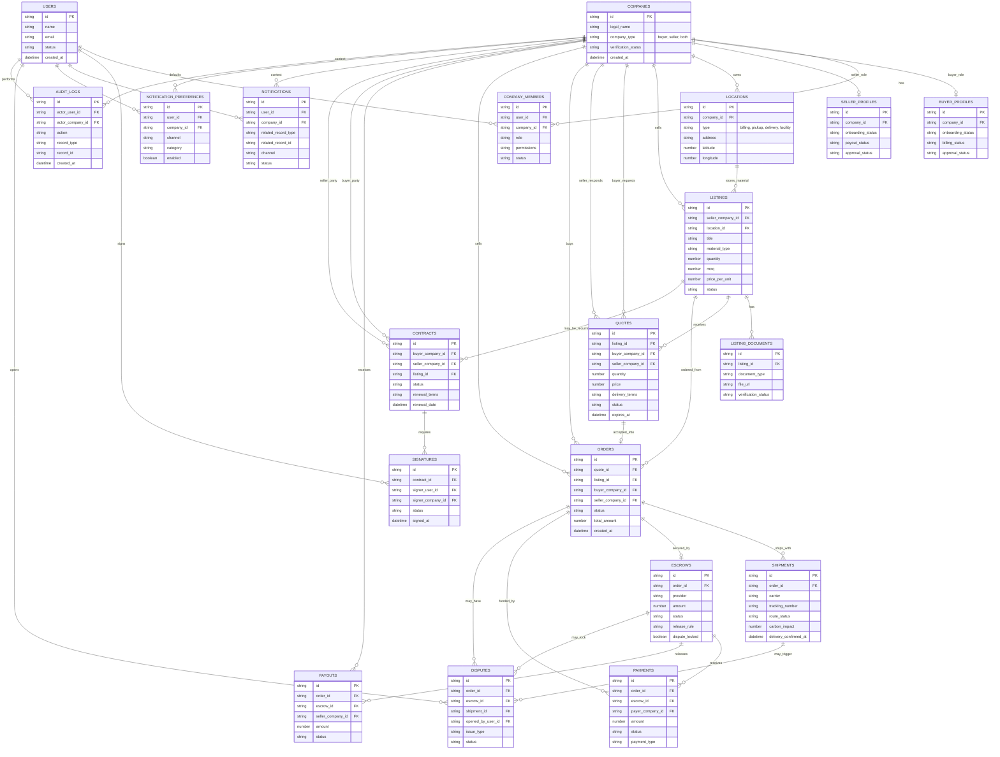

# EcoGlobe Database Design Plan

## Purpose

This document explains the proposed database structure for EcoGlobe before backend implementation begins. The goal is to align the team on the main business records, how they connect, and the order in which the backend data model should be built.

EcoGlobe is not just a listing website. It is a managed marketplace that needs to support buyer and seller accounts, feedstock listings, quotes, orders, escrow, logistics, documents, contracts, e-signatures, notifications, disputes, reporting, and admin oversight.

The database should be designed around three principles:

- Companies are the center of the platform.
- Orders are the center of the transaction lifecycle.
- Every important action should be traceable through audit history.

## Core Design Decision

A company should be able to act as a buyer, seller, or both.

That means the database should not treat buyer and seller as completely separate account types. Instead, the platform should have one `companies` record, with optional buyer and seller profiles attached to it.

This supports real-world marketplace behavior where a company may sell one material stream while buying another feedstock from a different supplier.

## High-Level Relationship Graph

## Main Data Areas

### Identity and Company Access

| Table | Purpose |
| --- | --- |
| `users` | Stores login identity, name, email, and account status. |
| `companies` | Stores the business entity. A company can be a buyer, seller, or both. |
| `companyMembers` | Connects users to companies and controls role-based access. |
| `buyerProfiles` | Stores buyer-specific onboarding, billing, approval, and purchasing readiness. |
| `sellerProfiles` | Stores seller-specific onboarding, payout, approval, and listing readiness. |

### Marketplace and Feedstock Records

| Table | Purpose |
| --- | --- |
| `locations` | Stores company addresses, pickup sites, delivery sites, and map coordinates. |
| `listings` | Stores feedstock/product records, quantity, MOQ, price, location, and status. |
| `listingDocuments` | Stores SDS files, certifications, lab reports, photos, and compliance documents. |

### Transaction Flow

| Table | Purpose |
| --- | --- |
| `quotes` | Stores proposed pricing, volume, delivery terms, expiration, and buyer/seller acceptance. |
| `orders` | Stores the accepted transaction between buyer and seller from inquiry through completion. |
| `shipments` | Stores carrier, route, tracking, delivery confirmation, and carbon impact. |
| `escrows` | Stores held funds, provider status, release rules, and dispute locks. |
| `payments` | Stores buyer funding, payment status, payment type, and escrow funding activity. |
| `payouts` | Stores seller payout records, payout status, fees, and release timing. |

### Contracts and Signatures

| Table | Purpose |
| --- | --- |
| `contracts` | Stores recurring feedstock supply agreements, terms, milestones, and renewal dates. |
| `signatures` | Stores signer status, signed timestamps, signer identity, and signed document references. |

### Communications, Disputes, and Oversight

| Table | Purpose |
| --- | --- |
| `notifications` | Stores in-app, email, and SMS alerts with delivery status. |
| `notificationPreferences` | Stores user and company preferences by channel and notification category. |
| `disputes` | Stores issues tied to orders, escrows, shipments, and resolution status. |
| `auditLogs` | Stores every important action across buyer, seller, admin, and system automation. |

## Recommended Transaction Lifecycle

```mermaid
flowchart LR
    A[Seller creates listing] --> B[Listing documents uploaded]
    B --> C[Admin or system verification]
    C --> D[Listing published]
    D --> E[Buyer requests quote]
    E --> F[Seller responds with quote]
    F --> G[Buyer accepts quote]
    G --> H[Order created]
    H --> I[Escrow funded]
    I --> J[Shipment scheduled]
    J --> K[Delivery confirmed]
    K --> L[Escrow released]
    L --> M[Seller payout completed]
    M --> N[Order completed]

    H --> O[Dispute opened]
    I --> O
    J --> O
    K --> O
    O --> P[Admin review]
    P --> Q[Resolve, refund, or release]
```

## Status History and Audit Trail

Each major record should have a current `status`, but status changes should not only live on the record itself.

For example, an order can have a current status of `in_transit`, but the platform should also know:

- Who changed the status.
- When it changed.
- What the previous status was.
- What the new status is.
- Whether the change came from a user, admin, carrier update, payment provider, or system automation.

This is why `auditLogs` is a required part of the design.

Later, we may also add focused history tables such as:

- `orderStatusEvents`
- `escrowStatusEvents`
- `shipmentTrackingEvents`
- `contractMilestones`
- `notificationDeliveryEvents`

The first version can start with `auditLogs`, then split into more specialized history tables as the workflows mature.

## Recommended Build Phases

### Phase 1: Backend Foundation

Build the records needed to replace the current frontend demo data with real backend data.

Recommended scope:

- `users`
- `companies`
- `companyMembers`
- `buyerProfiles`
- `sellerProfiles`
- `locations`
- `listings`
- `listingDocuments`
- `quotes`
- `orders`
- `notifications`
- `notificationPreferences`
- `auditLogs`

This phase supports the basic marketplace flow: company setup, listing management, browsing, quote requests, order creation, notifications, and admin visibility.

### Phase 2: Transaction Confidence

Add the records needed for trust, payment readiness, logistics, and exception handling.

Recommended scope:

- `shipments`
- `escrows`
- `payments`
- `payouts`
- `disputes`
- status event tracking
- delivery confirmation
- admin review queues

This phase supports real transaction management: shipment tracking, escrow funding, delivery confirmation, payout release, and dispute handling.

### Phase 3: Long-Term Commercial Workflows

Add the records needed for recurring business, contract management, compliance, and reporting.

Recommended scope:

- `contracts`
- `signatures`
- contract milestones
- renewal management
- sustainability milestones
- compliance deadlines
- report snapshots
- automation rules

This phase supports recurring supply agreements, e-signatures, renewal tracking, compliance visibility, and management reporting.

## Implementation Notes

The current backend schema is still early and mainly covers sellers, buyers, listings, and orders. The frontend now shows a much broader platform surface, including escrow, logistics, notifications, contracts, e-signatures, documents, and admin operations.

Before coding, the team should agree that the backend model needs to grow from a simple marketplace schema into a full transaction-management schema.

The recommended approach is:

1. Keep companies at the center.
2. Let one company act as buyer, seller, or both.
3. Treat orders as the center of the transaction.
4. Attach escrow, payment, shipment, dispute, contract, and notification records to orders.
5. Track important status changes in audit history from the beginning.
6. Build in phases so the team does not overbuild before demo needs are clear.

## Questions for Team Review

These are the questions worth confirming before implementation:

- Should company roles be limited to buyer, seller, and both, or do we need more granular role types?
- Should quotes always come before orders, or should admins be able to create an order directly?
- Should every order require escrow, or should escrow be optional for some transaction types?
- Should contracts always link to listings, or can a contract cover custom/off-platform materials?
- Should notifications be user-specific only, or should some notifications be company-wide?
- What records must be included in the admin audit trail for compliance?

## Recommended Team Decision

Use this database model as the planning baseline.

The first backend implementation should focus on Phase 1 only, while leaving the table structure clean enough to add Phase 2 and Phase 3 without major rework.

