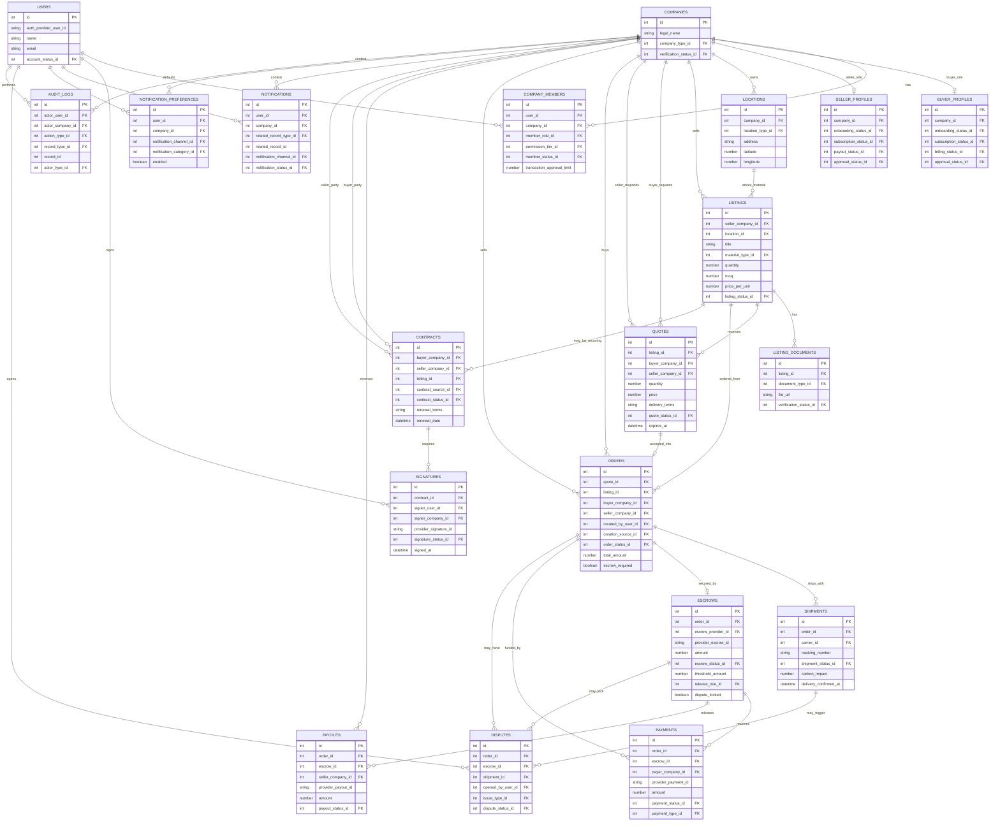

# EcoGlobe Database Design Plan

## Purpose

This document explains the proposed database structure for EcoGlobe before backend implementation begins. The goal is to align the team on the main business records, how they connect, and the order in which the backend data model should be built.

EcoGlobe is not just a listing website. It is a managed marketplace that needs to support buyer and seller accounts, feedstock listings, quotes, orders, escrow, logistics, documents, contracts, e-signatures, notifications, disputes, reporting, and admin oversight.

The database should be designed around three principles:

- Companies are the center of the platform.
- Orders are the center of the transaction lifecycle.
- Every important action should be traceable through audit history.

## Primary Key Decision

For an Azure SQL implementation, primary keys and foreign keys should use integer identity fields.

The database planning graph below uses `int id PK` and `int *_id FK` to reflect the preferred SQL design:

- Primary keys should be integer identity values.
- Foreign keys should reference those integer primary keys.
- External IDs from auth providers, payment providers, escrow providers, document storage, and carriers should be stored as separate string fields.
- Lookup/reference values should use dedicated lookup tables where the values need governance, reporting consistency, or admin configuration.

This keeps referential integrity clear, improves indexing efficiency, and aligns better with a traditional SQL database design.

The Azure SQL schema should use integer identity keys for internal relational records. External system identifiers should be stored separately and should not become the internal primary keys.

## Standard Support Fields

Every operational table should include consistent support fields for troubleshooting, support, and diagnostics.

Recommended field names:

| Field | Type | Purpose |
| --- | --- | --- |
| `created_by_user_id` | `int FK` | User who created the record. Nullable for system imports or automated records. |
| `created_at` | `datetime` | Date and time the record was created. |
| `updated_by_user_id` | `int FK` | User who last edited the record. Nullable for system automation. |
| `updated_at` | `datetime` | Date and time the record was last edited. |

These fields should be applied consistently across core business tables such as companies, profiles, locations, listings, documents, quotes, orders, shipments, escrows, payments, payouts, contracts, signatures, notifications, disputes, and audit-related records.

Lookup tables may also include these fields when EcoGlobe admins can add or edit lookup values over time.

## Lookup Table Decision

Status, type, role, source, and category values should generally use integer lookup IDs instead of freeform strings.

This applies to fields such as:

- Account status.
- Company type.
- Verification status.
- Member role.
- Member status.
- Onboarding status.
- Subscription status.
- Billing status.
- Approval status.
- Payout status.
- Location type.
- Listing status.
- Document type.
- Document verification status.
- Quote status.
- Order status.
- Order creation source.
- Shipment status.
- Escrow provider.
- Escrow status.
- Escrow release rule.
- Payment status.
- Payment type.
- Contract source.
- Contract status.
- Signature status.
- Notification channel.
- Notification category.
- Notification status.
- Dispute issue type.
- Dispute status.
- Audit action type.
- Record type.
- Actor type.

Recommended lookup table pattern:

| Field | Type | Purpose |
| --- | --- | --- |
| `id` | `int PK` | Internal lookup ID. |
| `code` | `varchar` | Stable system code, such as `pending_review`. |
| `name` | `varchar` | User-facing label, such as `Pending Review`. |
| `description` | `varchar` | Optional explanation. |
| `is_active` | `bit` | Whether the lookup value is active. |
| `sort_order` | `int` | Display order in menus and admin screens. |

Using lookup tables gives EcoGlobe more flexibility to add, rename, deactivate, or report on statuses without changing application code for every new business requirement.

Not every string field should become a lookup. Descriptive values and external provider values should stay as strings, including file URLs, tracking numbers, provider transaction IDs, notes, addresses, and document storage paths.

## Core Design Decision

A company should be able to act as a buyer, seller, or both.

That means the database should not treat buyer and seller as completely separate account types. Instead, the platform should have one `companies` record, with optional buyer and seller profiles attached to it.

This supports real-world marketplace behavior where a company may sell one material stream while buying another feedstock from a different supplier.

EcoGlobe will support three account states:

- Subscribed buyer.
- Subscribed seller.
- Unsubscribed user for general accounts.

Within subscribed buyer accounts, permissions need to be tiered. The most important permission boundary is transaction authority: who can approve and execute transactions, especially for large dollar amounts.

Admins also need controlled override ability. They should be able to create orders directly without requiring a quote first, while those actions are clearly recorded in the audit trail.

## High-Level Relationship Graph

For readability, the ERD does not repeat the standard support fields on every table. Unless noted otherwise, operational tables should still include `created_by_user_id`, `created_at`, `updated_by_user_id`, and `updated_at`.

```mermaid
erDiagram
    USERS {
        int id PK
        string auth_provider_user_id
        string name
        string email
        int account_status_id FK
    }

    COMPANIES {
        int id PK
        string legal_name
        int company_type_id FK
        int verification_status_id FK
    }

    COMPANY_MEMBERS {
        int id PK
        int user_id FK
        int company_id FK
        int member_role_id FK
        int permission_tier_id FK
        int member_status_id FK
        number transaction_approval_limit
    }

    BUYER_PROFILES {
        int id PK
        int company_id FK
        int onboarding_status_id FK
        int subscription_status_id FK
        int billing_status_id FK
        int approval_status_id FK
    }

    SELLER_PROFILES {
        int id PK
        int company_id FK
        int onboarding_status_id FK
        int subscription_status_id FK
        int payout_status_id FK
        int approval_status_id FK
    }

    LOCATIONS {
        int id PK
        int company_id FK
        int location_type_id FK
        string address
        number latitude
        number longitude
    }

    LISTINGS {
        int id PK
        int seller_company_id FK
        int location_id FK
        string title
        int material_type_id FK
        number quantity
        number moq
        number price_per_unit
        int listing_status_id FK
    }

    LISTING_DOCUMENTS {
        int id PK
        int listing_id FK
        int document_type_id FK
        string file_url
        int verification_status_id FK
    }

    QUOTES {
        int id PK
        int listing_id FK
        int buyer_company_id FK
        int seller_company_id FK
        number quantity
        number price
        string delivery_terms
        int quote_status_id FK
        datetime expires_at
    }

    ORDERS {
        int id PK
        int quote_id FK
        int listing_id FK
        int buyer_company_id FK
        int seller_company_id FK
        int created_by_user_id FK
        int creation_source_id FK
        int order_status_id FK
        number total_amount
        boolean escrow_required
    }

    SHIPMENTS {
        int id PK
        int order_id FK
        int carrier_id FK
        string tracking_number
        int shipment_status_id FK
        number carbon_impact
        datetime delivery_confirmed_at
    }

    ESCROWS {
        int id PK
        int order_id FK
        int escrow_provider_id FK
        string provider_escrow_id
        number amount
        int escrow_status_id FK
        number threshold_amount
        int release_rule_id FK
        boolean dispute_locked
    }

    PAYMENTS {
        int id PK
        int order_id FK
        int escrow_id FK
        int payer_company_id FK
        string provider_payment_id
        number amount
        int payment_status_id FK
        int payment_type_id FK
    }

    PAYOUTS {
        int id PK
        int order_id FK
        int escrow_id FK
        int seller_company_id FK
        string provider_payout_id
        number amount
        int payout_status_id FK
    }

    CONTRACTS {
        int id PK
        int buyer_company_id FK
        int seller_company_id FK
        int listing_id FK
        int contract_source_id FK
        int contract_status_id FK
        string renewal_terms
        datetime renewal_date
    }

    SIGNATURES {
        int id PK
        int contract_id FK
        int signer_user_id FK
        int signer_company_id FK
        string provider_signature_id
        int signature_status_id FK
        datetime signed_at
    }

    NOTIFICATIONS {
        int id PK
        int user_id FK
        int company_id FK
        int related_record_type_id FK
        int related_record_id
        int notification_channel_id FK
        int notification_status_id FK
    }

    NOTIFICATION_PREFERENCES {
        int id PK
        int user_id FK
        int company_id FK
        int notification_channel_id FK
        int notification_category_id FK
        boolean enabled
    }

    DISPUTES {
        int id PK
        int order_id FK
        int escrow_id FK
        int shipment_id FK
        int opened_by_user_id FK
        int issue_type_id FK
        int dispute_status_id FK
    }

    AUDIT_LOGS {
        int id PK
        int actor_user_id FK
        int actor_company_id FK
        int action_type_id FK
        int record_type_id FK
        int record_id
        int actor_type_id FK
    }

    USERS ||--o{ COMPANY_MEMBERS : joins
    COMPANIES ||--o{ COMPANY_MEMBERS : has

    COMPANIES ||--o| BUYER_PROFILES : buyer_role
    COMPANIES ||--o| SELLER_PROFILES : seller_role
    COMPANIES ||--o{ LOCATIONS : owns

    COMPANIES ||--o{ LISTINGS : sells
    LOCATIONS ||--o{ LISTINGS : stores_material
    LISTINGS ||--o{ LISTING_DOCUMENTS : has

    LISTINGS ||--o{ QUOTES : receives
    COMPANIES ||--o{ QUOTES : buyer_requests
    COMPANIES ||--o{ QUOTES : seller_responds

    QUOTES ||--o| ORDERS : accepted_into
    LISTINGS ||--o{ ORDERS : ordered_from
    COMPANIES ||--o{ ORDERS : buys
    COMPANIES ||--o{ ORDERS : sells

    ORDERS ||--o{ SHIPMENTS : ships_with
    ORDERS ||--o| ESCROWS : secured_by
    ORDERS ||--o{ PAYMENTS : funded_by
    ESCROWS ||--o{ PAYMENTS : receives
    ESCROWS ||--o{ PAYOUTS : releases
    COMPANIES ||--o{ PAYOUTS : receives

    LISTINGS ||--o{ CONTRACTS : may_be_recurring
    COMPANIES ||--o{ CONTRACTS : buyer_party
    COMPANIES ||--o{ CONTRACTS : seller_party
    CONTRACTS ||--o{ SIGNATURES : requires
    USERS ||--o{ SIGNATURES : signs

    USERS ||--o{ NOTIFICATIONS : receives
    COMPANIES ||--o{ NOTIFICATIONS : context
    USERS ||--o{ NOTIFICATION_PREFERENCES : controls
    COMPANIES ||--o{ NOTIFICATION_PREFERENCES : defaults

    ORDERS ||--o{ DISPUTES : may_have
    ESCROWS ||--o{ DISPUTES : may_lock
    SHIPMENTS ||--o{ DISPUTES : may_trigger
    USERS ||--o{ DISPUTES : opens

    USERS ||--o{ AUDIT_LOGS : performs
    COMPANIES ||--o{ AUDIT_LOGS : context
```

## Main Data Areas

### Identity and Company Access

| Table | Purpose |
| --- | --- |
| `users` | Stores login identity, name, email, and account status. |
| `companies` | Stores the business entity. A company can be a buyer, seller, or both. |
| `companyMembers` | Connects users to companies and controls role-based access. |
| `buyerProfiles` | Stores buyer-specific onboarding, subscription status, billing, approval, and purchasing readiness. |
| `sellerProfiles` | Stores seller-specific onboarding, subscription status, payout, approval, and listing readiness. |

### Roles, Subscriptions, and Permissions

EcoGlobe should separate account type from user permission.

Account type answers what the company can do on the platform:

- Subscribed buyer.
- Subscribed seller.
- Unsubscribed user/general account.

Permissions answer what a specific user can do inside a company account:

- View marketplace activity.
- Request quotes.
- Approve transactions.
- Execute transactions.
- Manage billing or payout settings.
- Manage company users and permissions.

For subscribed buyer accounts, transaction permissions should support amount-based approval rules. For example, one user may be allowed to request quotes, while another user is required to approve or execute orders above a certain dollar amount.

This matters because EcoGlobe transactions can become large, and the platform needs clear controls around who is authorized to commit company funds.

### Marketplace and Feedstock Records

| Table | Purpose |
| --- | --- |
| `locations` | Stores company addresses, pickup sites, delivery sites, and map coordinates. |
| `listings` | Stores feedstock/product records, quantity, MOQ, price, location, and status. |
| `listingDocuments` | Stores SDS files, certifications, lab reports, photos, and compliance documents. |

### Transaction Flow

| Table | Purpose |
| --- | --- |
| `quotes` | Stores proposed pricing, volume, delivery terms, expiration, and buyer/seller acceptance. |
| `orders` | Stores the accepted transaction between buyer and seller from inquiry through completion. Orders can come from an accepted quote or be created directly by an admin. |
| `shipments` | Stores carrier, route, tracking, delivery confirmation, and carbon impact. |
| `escrows` | Stores held funds, provider status, release rules, and dispute locks. Escrow is required for orders above $1,000. |
| `payments` | Stores buyer funding, payment status, payment type, and escrow funding activity. |
| `payouts` | Stores seller payout records, payout status, fees, and release timing. |

### Contracts and Signatures

| Table | Purpose |
| --- | --- |
| `contracts` | Stores recurring feedstock supply agreements, terms, milestones, and renewal dates. Contracts may link to a listing or support custom/off-platform deals. |
| `signatures` | Stores signer status, signed timestamps, signer identity, and signed document references. |

### Communications, Disputes, and Oversight

| Table | Purpose |
| --- | --- |
| `notifications` | Stores in-app, email, and SMS alerts with delivery status. |
| `notificationPreferences` | Stores company-wide defaults and user-level overrides by channel and notification category. |
| `disputes` | Stores issues tied to orders, escrows, shipments, and resolution status. |
| `auditLogs` | Stores every important action across buyer, seller, admin, and system automation. |

## Recommended Transaction Lifecycle

```mermaid
flowchart LR
    A[Seller creates listing] --> B[Listing documents uploaded]
    B --> C[Admin or system verification]
    C --> D[Listing published]
    D --> E[Buyer requests quote]
    E --> F[Seller responds with quote]
    F --> G[Buyer accepts quote]
    G --> H[Order created]
    AA[Admin creates order directly] --> H
    H --> I[Escrow funded]
    I --> J[Shipment scheduled]
    J --> K[Delivery confirmed]
    K --> L[Escrow released]
    L --> M[Seller payout completed]
    M --> N[Order completed]

    H --> O[Dispute opened]
    I --> O
    J --> O
    K --> O
    O --> P[Admin review]
    P --> Q[Resolve, refund, or release]
```

## Escrow Rule

Escrow should not be optional for normal transactions above the defined threshold.

Current rule:

- Orders above `$1,000` require escrow.
- Test or sample transactions below `$1,000` do not require escrow.

The order record should store whether escrow is required at the time the order is created. This avoids confusion if the platform threshold changes later.

The escrow record should then track funding, release triggers, dispute locks, and payout readiness.

## Contract Rule

Contracts should support two paths:

- Listing-based contracts, where the contract is connected to a platform listing.
- Custom contracts, where the contract covers an off-platform or pre-negotiated deal.

Custom contracts are allowed because both parties may want to use EcoGlobe's escrow, documentation, and reporting infrastructure even when the material was negotiated outside the marketplace listing flow.

Requirement:

- Off-platform/custom contracts should still require both parties to be registered EcoGlobe users.
- Both companies should be represented in the platform.
- The contract should clearly record whether it came from a platform listing or a custom/off-platform workflow.

## Notification Rule

Notifications should be user-specific by default.

Admins should be able to set company-wide notification defaults, and individual users should be able to override their own preferences through a notification settings menu.

This creates a practical hierarchy:

1. Platform-required notifications that cannot be disabled for compliance or transaction safety.
2. Company-wide defaults controlled by admins or company managers.
3. User-level overrides controlled by individual users.

Examples of notifications that may need stronger controls:

- Order approval required.
- Escrow funding required.
- Escrow released.
- Payment failed.
- Delivery confirmed.
- Dispute opened.
- Permission changed.

## Admin Direct Order Rule

Quotes should remain the normal marketplace path, but admins must be able to create an order directly.

Direct admin-created orders should be used for exceptions, operational support, custom deals, or cases where the transaction has already been agreed to outside the standard quote flow.

The database should record:

- Whether the order came from a quote or an admin direct action.
- Which admin created the order.
- Which buyer and seller were attached.
- Why the direct order was created.
- Whether escrow is required based on the order amount.

This should always generate an audit log entry.

## Status History and Audit Trail

Each major record should have a current `status`, but status changes should not only live on the record itself.

For example, an order can have a current status of `in_transit`, but the platform should also know:

- Who changed the status.
- When it changed.
- What the previous status was.
- What the new status is.
- Whether the change came from a user, admin, carrier update, payment provider, or system automation.

This is why `auditLogs` is a required part of the design.

Later, we may also add focused history tables such as:

- `orderStatusEvents`
- `escrowStatusEvents`
- `shipmentTrackingEvents`
- `contractMilestones`
- `notificationDeliveryEvents`

The first version can start with `auditLogs`, then split into more specialized history tables as the workflows mature.

## Required Audit Coverage

The admin audit trail should capture every compliance-relevant action.

Required audit categories:

- Quote lifecycle events.
- Order lifecycle events.
- Transaction approvals.
- Transaction execution.
- Escrow trigger events.
- Escrow release events.
- Payment events.
- Payout events.
- User access changes.
- Permission changes.
- Admin actions taken on behalf of users.
- Admin actions taken outside standard workflows.

Every audit record should include:

- Timestamp.
- Acting user ID.
- Acting company ID when applicable.
- Whether the actor was a user, admin, or system automation.
- Record type.
- Record ID.
- Action performed.
- Previous value when applicable.
- New value when applicable.
- Reason or note when required.

Access rule:

- Audit logs should be visible to admins only.
- Audit logs should be exportable for compliance, dispute resolution, and internal review.

## Recommended Build Phases

### Phase 1: Backend Foundation

Build the records needed to replace the current frontend demo data with real backend data.

Recommended scope:

- `users`
- `companies`
- `companyMembers`
- `buyerProfiles`
- `sellerProfiles`
- tiered buyer permissions
- `locations`
- `listings`
- `listingDocuments`
- `quotes`
- `orders`
- admin direct order creation
- `notifications`
- `notificationPreferences`
- `auditLogs`

This phase supports the basic marketplace flow: company setup, listing management, browsing, quote requests, order creation, notifications, and admin visibility.

### Phase 2: Transaction Confidence

Add the records needed for trust, payment readiness, logistics, and exception handling.

Recommended scope:

- `shipments`
- `escrows`
- `payments`
- `payouts`
- `disputes`
- escrow threshold enforcement
- status event tracking
- delivery confirmation
- admin review queues

This phase supports real transaction management: shipment tracking, escrow funding, delivery confirmation, payout release, and dispute handling.

### Phase 3: Long-Term Commercial Workflows

Add the records needed for recurring business, contract management, compliance, and reporting.

Recommended scope:

- `contracts`
- `signatures`
- custom/off-platform contract support
- contract milestones
- renewal management
- sustainability milestones
- compliance deadlines
- report snapshots
- automation rules

This phase supports recurring supply agreements, e-signatures, renewal tracking, compliance visibility, and management reporting.

## Implementation Notes

The Azure SQL dev/demo baseline now covers the broader transaction-management model, including identity, companies, listings, quotes, orders, logistics, escrow, payments, contracts, signatures, notifications, disputes, and audit logs.

The current backend API foundation can verify Azure SQL connectivity and inspect the schema. The next implementation work is to add authenticated business endpoints and replace frontend demo data incrementally.

The recommended approach is:

1. Keep companies at the center.
2. Let one company act as buyer, seller, or both.
3. Treat orders as the center of the transaction.
4. Attach escrow, payment, shipment, dispute, contract, and notification records to orders.
5. Track important status changes in audit history from the beginning.
6. Keep the current SQL baseline versioned and move to formal migrations before production.

## Confirmed Team Decisions

These decisions have been confirmed and should guide implementation:

- EcoGlobe will support subscribed buyers, subscribed sellers, and unsubscribed general users.
- Subscribed buyer accounts need tiered permissions for approval and execution of transactions, especially for large amounts.
- Admins can create orders directly without requiring a quote first.
- Escrow applies to all orders above `$1,000`.
- Test or sample transactions below `$1,000` do not require escrow.
- Contracts can link to platform listings or support custom/off-platform agreements.
- Off-platform contracts still require both parties to be registered users on EcoGlobe.
- Notifications are user-specific by default.
- Admins can define company-wide notification defaults.
- Individual users can override their own notification preferences.
- The audit trail must capture transaction lifecycle events, user access changes, permission changes, admin actions, escrow events, and payment events.
- Audit logs must include timestamps and user IDs for every action.
- Audit logs should be admin-only and exportable.

## Recommended Team Decision

Use this database model as the planning baseline.

The first backend implementation should focus on Phase 1 only, while leaving the table structure clean enough to add Phase 2 and Phase 3 without major rework.
