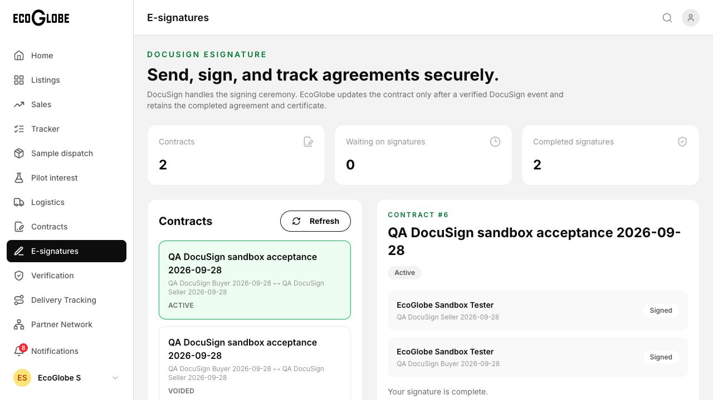
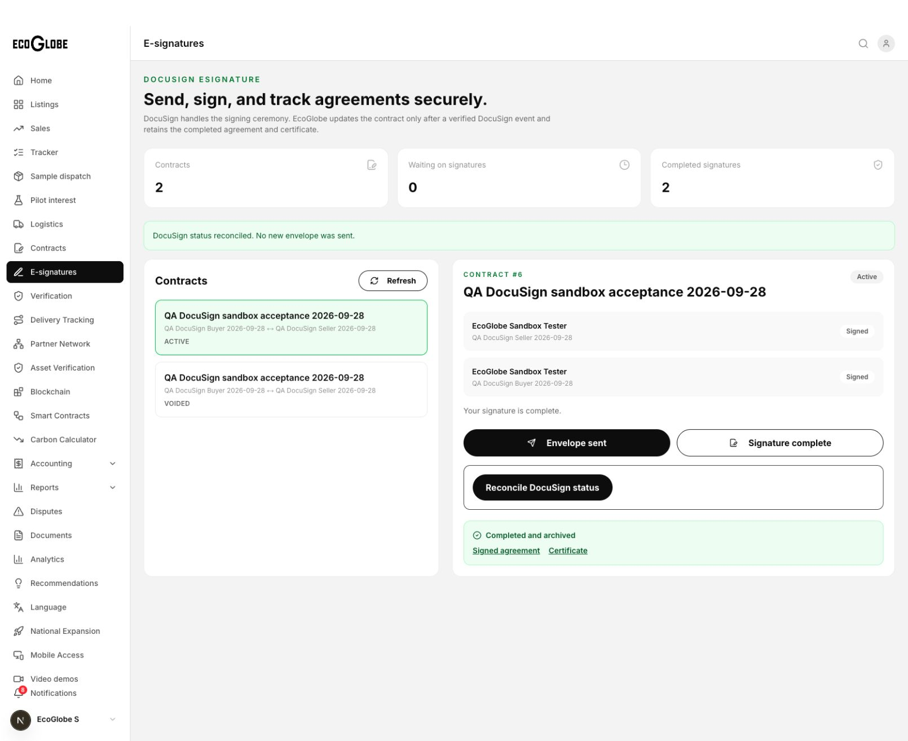
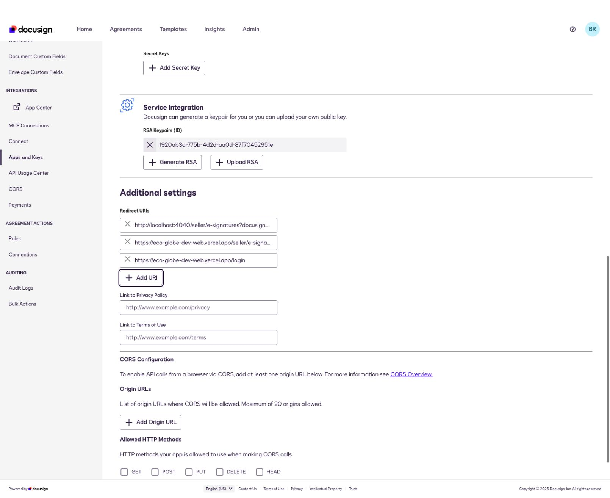

# DocuSign sandbox acceptance — 2026-09-28

## Verified locally against real providers

- Demo integration configured with RSA JWT consent, Buyer/Seller template roles, HMAC secret, private Azure archive, and requested `https://eco-globe-dev-web.vercel.app/login` redirect URI.
- Browser sent contract 6 and completed buyer and seller signing ceremonies for the explicitly authorized nonbinding test agreement. Envelope: `76ca2691-ff69-88c7-80cd-6e0eee901cfe`.
- Provider reconciliation changed contract 6 to Active, with both signatures Signed and Completed and archived displayed in the frontend.
- Browser downloaded the agreement and completion certificate through the authenticated frontend proxy. Downloaded bytes match the backend archive exactly. PDF visually inspected: two signatures, clear test-only text. Certificate: Completed, Signatures: 2.
- Anonymous agreement/certificate API downloads rejected with 401. Modified webhook bytes rejected with 401. Valid locally generated HMAC event and duplicate replay returned 200. This verifies the handler, not actual provider delivery.
- Role switching reproduced a stale company/session bug. Buyer/seller menus now change the authenticated backend session company; existing membership is required, attempted admin escalation returns 403, invalid session returns 401. Correct seller signing assignment verified in the browser.
- Forged signing evidence, unauthorized signed-state mutation, repeat send, and post-send contract/signer changes rejected in earlier API checks.

## Fixes exercised

Exact signer authorization, same-identity sequential signing turns, persistent send reservation and recovery, verified provider status reconciliation, generic CRUD evidence restrictions, private non-overwriting PDF storage, duplicate webhook handling, and role/company session switching.

The first test envelope (`76a4264d-c03a-85bf-805f-654846941cc4`) was voided with explicit approval after DocuSign merged identical recipients. Its replacement completed successfully.

## Checks

- Backend regression suite: 42/42 passed (requires local socket permission).
- Backend build and FE/BE type checks passed.
- Isolated frontend production build passed after role-switch fixes; existing repository lint warnings remain.
- Real HTTP role-switch checks: 4 passed.
- Real completed-PDF and HMAC replay checks passed.

## Deployed development release

User authorized deployment and then explicitly requested committing/deploying all pending project changes. The release includes pending Stripe setup, feedback fixes, design concepts, and workflow documentation. Local credentials and generated runtime files remain ignored.

- Frontend: `https://eco-globe-dev-web.vercel.app`, deployment `dpl_2ssAJ7RMdRa74hVxSb5nZnZPKzfF`. Vercel production build passed for this development project.
- Backend: `ecoglobe-backend-dev--0000025`, Healthy, 100% traffic. ACR run `car`, image digest `sha256:92afbef3ca6f854c1fc70b92a6e757bdcb5f14f9bd274f6f7b1682d042ffd024`.
- Demo signing key and HMAC secret stored in existing Azure Key Vault; backend uses managed identity secret references. Private storage uses the existing storage connection credential.
- Connect configuration `22342026` is active. The completed test envelope was republished through DocuSign's historical-envelope publishing API, transaction `5096bc53-ba17-4eea-8c92-1cd3dabca357`. Actual provider event was received and recorded as webhook event 2, `envelope-completed`, `processed`, no error, at `2026-09-28T18:18:49.159Z`.
- Browser verified deployed buyer login, completed agreement, both document downloads, seller company switching, and seller completion state. Deployed downloaded PDFs match the locally verified archive hashes exactly.
- Nine deployed API checks passed: recovery/reconciliation, repeat-send refusal, completed-signature refusal, denied admin role escalation, anonymous document denial, unsigned webhook denial, and correct seller/buyer/seller company context.
- Both additive migrations are present in the development database; no reset performed.

The two signing ceremonies were completed through the local frontend/backend against the real demo provider before deployment. The deployed system was then verified using the same completed envelope, real provider webhook delivery, private downloads, role switching, and negative API checks. A new signing ceremony was not repeated on the deployed URL.

Local full-build retry encountered restricted Google Fonts network access; the full remote Vercel build passed. React Doctor reports existing broad-branch issues (44/100, 7 errors); focused lint/type checks passed. This is not a claim that every unrelated marketplace flow has full acceptance coverage. Prior feedback and Stripe reports retain their outstanding test limitations.

Rollback references: Azure revision `0000024`; previous Vercel deployment `dpl_CENzgATdtPfpEHCYYLDVBDU4HZUh`.

## Remaining production gates

This is a sandbox test template, not approved commercial agreement language. Production requires the final agreement/template and DocuSign production Go-Live configuration. Local storage SAS expires October 4; deployed runtime should use existing Azure storage credentials, not this temporary SAS. Non-overwriting application writes do not establish a legal immutable-retention policy.

## Evidence

