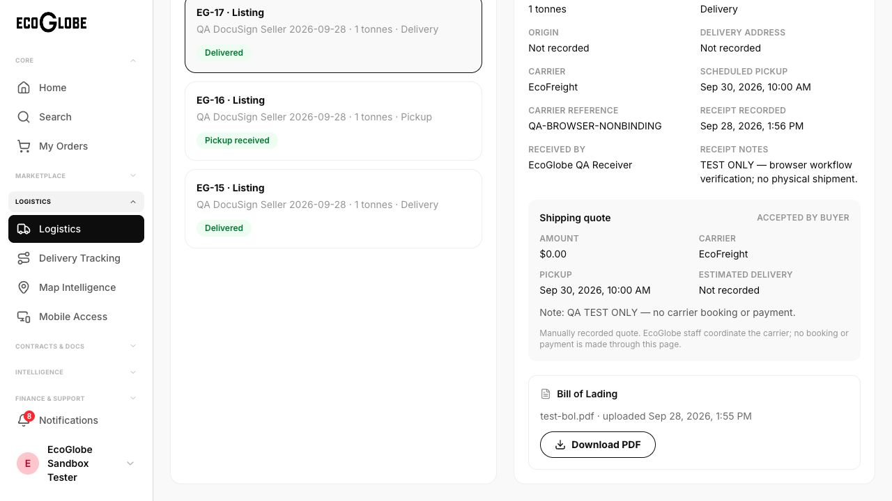
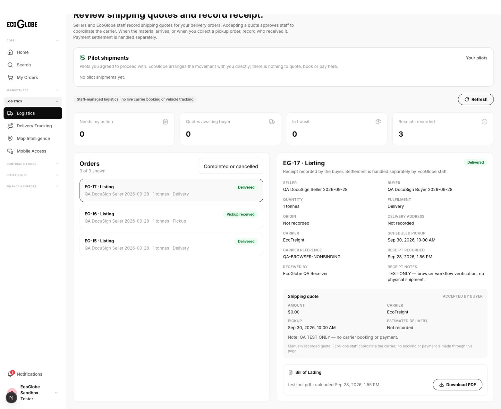
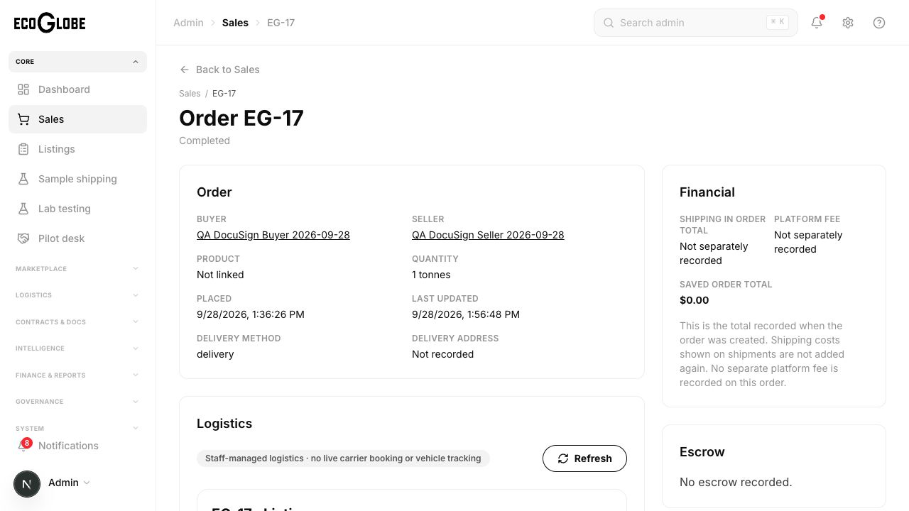
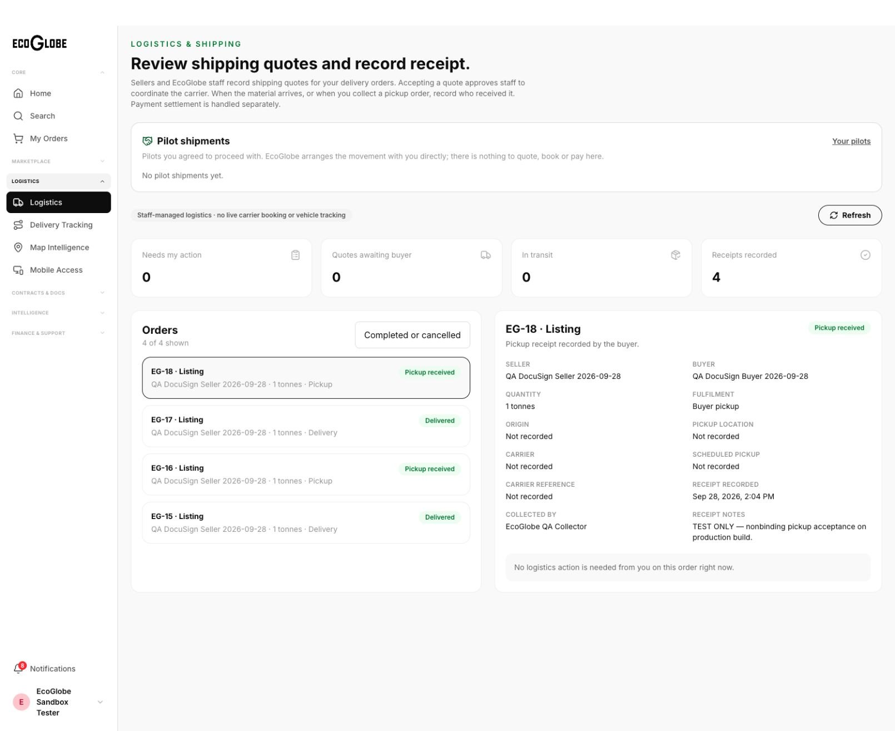
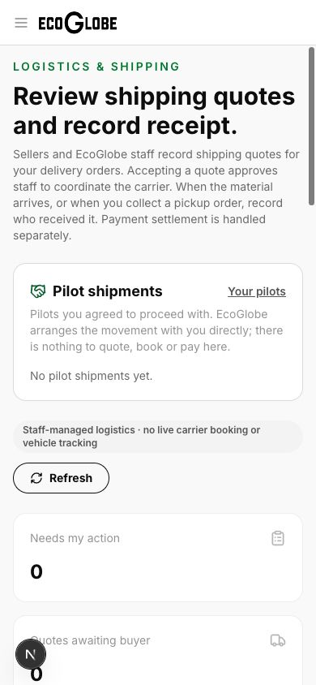

# Logistics MVP verification — 2026-09-28

Status: staff-managed logistics MVP implemented, committed and deployed to development. Local end-to-end browser acceptance and deployed persistence, authorization and download checks passed.

## Scope

Staff-managed order fulfilment: seller or admin records a carrier quote, buyer accepts it, seller/admin privately attaches a PDF Bill of Lading and records dispatch, buyer records inspection and receipt. Pickup orders have a separate receipt path. Actions persist in Azure SQL, generate participant in-app notifications, and are audited. Delivery receipt completes the order atomically; it does not release escrow or move funds.

Automatic carrier rates, carrier purchasing/booking, vehicle GPS, and automatic payment settlement are outside this staff-managed MVP. Existing pilot shipment workflows remain separate. Maps show only saved coordinates; missing coordinates are not invented.

## Coordination

Orca run `run_722bb87a6df4`: Codex backend coordinator and Claude frontend worker (`ctx_904fdba655b8`) in the managed logistics-frontend worktree. Claude completed frontend implementation and reciprocal backend review; Codex reviewed the frontend diffs and integrated the reviewed files. Follow-up dispatches `ctx_817cfebcc586` and `ctx_f661572261a6` resolved review and browser findings. Workers were released after handoff.

## Backend evidence

- Additive migration `20260928_logistics_mvp.sql` applied successfully to development Azure SQL; no database reset.
- Backend type checking passed.
- Backend regression tests: 44 passed.
- Local API against development SQL: 42 checks passed: 30 delivery/pickup workflow checks, 7 admin/negative checks, and 5 quote validation checks.
- Authorization: missing bearer rejected; buyer cannot quote/upload/dispatch, seller cannot accept/confirm, admin cannot impersonate buyer acceptance/receipt; unrelated companies cannot download a BOL or confirm receipt.
- Workflow: invalid amount, stale quote ID, dispatch without BOL, malformed PDF and incomplete inspection rejected; private PDF round-trip matched original bytes.
- Concurrent acceptance and repeated actions: one shipment, five workflow events, ten participant notifications for delivery order15. No escrow records created for test orders15/16.
- Legacy order-shipment POST/PATCH and direct order completion reject bypasses of the new workflow.
- Runtime isolation regressions:22 passed; SQL ownership regressions:12 passed. Initial sandbox-only failures were permissions errors; permitted runs passed.

## Test data

Existing approved QA user42 and buyer/seller companies42/43. Orders15(delivery),16(pickup),17(browser delivery),18(browser pickup) are explicitly labeled nonbinding QA orders with zero totals. No carrier booking or payment was executed. Test credentials and artifacts remain in ignored `.local/logistics/` and are not part of this report.

## Frontend and browser acceptance

- Frontend and backend type checks, backend build, and frontend production build passed.
- Focused lint passed with one existing image warning. Full web lint is blocked by 1,191 errors in vendored MapLibre JavaScript. Focused React Doctor: 3 warnings (complexity and handler-only state), no error diagnostics; reported score 49/100. Its changed-file scan covered 14 tracked files, not the entire application.
- Delivery order17 completed through the browser: seller records zero-cost QA quote; buyer accepts; seller uploads a real test PDF then dispatches; buyer enters receiver, inspection confirmation and notes. Every stage survived reload.
- Required carrier, receiver and inspection validation were exercised. Admin sees saved receipt and a disputed order's read-only logistics state, and cannot act as buyer.
- Pickup order18 completed through the built production frontend locally, using the separate collection/inspection receipt form; reload preserved the collector and notes.
- Final SQL inspection: orders15–18 each completed with exactly one delivered shipment and a saved receiver; no payments or escrow rows created.
- Private BOL download passed in the browser. Downloaded `order-17-bol.pdf` SHA-256 matches uploaded PDF: `cba193910a4983588d871a37a3c2cbb1b8408c793bbbce2923787a1fcea248a1`.
- A backend outage reproduced a session-loss bug. The guard now blocks portal content and offers retry for transport/server failures; restarting the backend restored the existing session without login. Definitive authentication failures still clear the session.
- Mobile viewport 390×844 passed: document width equals viewport width, without horizontal overflow.

## Test guide

1. Use a buyer/seller company with an in-progress order. Open Logistics from the portal sidebar.
2. For delivery, seller/admin records an active carrier, quote amount and future pickup time. Buyer switches to the matching company and accepts the quote.
3. Seller/admin uploads the PDF Bill of Lading, then records dispatch. Uploading alone does not dispatch.
4. Buyer confirms arrival with receiver name and inspection checkbox. Reload and filter Completed to verify the saved receipt.
5. For pickup, buyer confirms collection using the pickup receipt form. No carrier quote or BOL is required.
6. Admin can monitor both parties' saved workflow. Disputed orders are locked. Missing map coordinates are displayed as unavailable.

## Development release

- Application commit: `b48fdbf`, pushed to `codex/deploy-ecoglobe-backend`.
- Frontend: https://eco-globe-dev-web.vercel.app; Vercel deployment `dpl_6GwkzeiGTUWbom9d75v58F29arBR`, Ready. Remote production build passed for the existing development project.
- Backend: `ecoglobe-backend-dev--0000026`, Healthy, 100% traffic. ACR build `cas`; image `ecoglobe-backend:logistics-b48fdbf`, digest `sha256:71771405c93384fe265174e5de0c96077eaa11c66e81e5c4f53f0383522f6e01`.
- Thirteen deployed API assertions passed: authenticated role workspaces; saved completed delivery/pickup receipts; anonymous denial; cross-company BOL denial; admin buyer-action denial; direct completion bypass denial; downloaded PDF integrity.
- Browser on the deployed URL showed the new staff-managed logistics UI, both saved receipts, carrier reference, receiver/collector and notes. Authenticated BOL download matched the recorded SHA-256 exactly.
- The complete mutation stories were exercised locally against development SQL before deployment. Deployment acceptance reused those persisted orders; a fresh complete mutation story was not repeated on the public development URL.
- Vercel emitted an existing build environment declaration warning for `ECOGLOBE_API_BASE_URL`; authenticated deployed proxy requests and downloads passed. Broad repository lint/React Doctor limitations are recorded above.
- Rollback references: Azure revision `0000025` / previous image `docusign-20260928`; Vercel deployment `dpl_2ssAJ7RMdRa74hVxSb5nZnZPKzfF`. The additive SQL migration may remain for rollback; no reset is needed.

## Evidence

