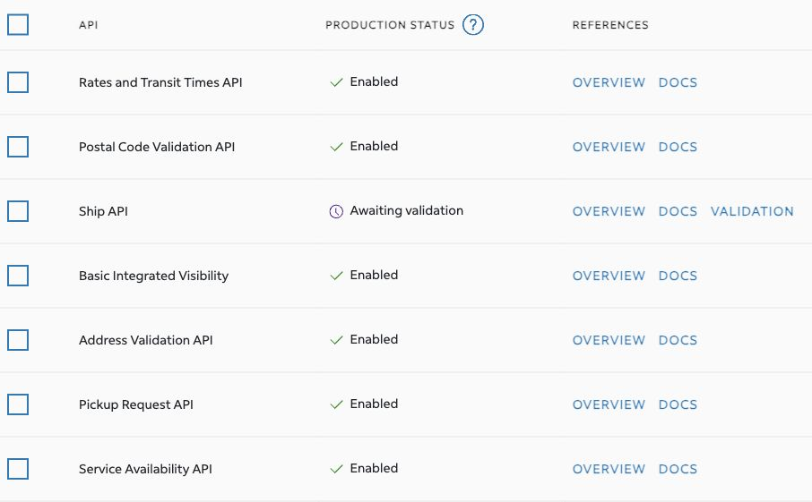

# FedEx production activation — 29 September 2026

## Completed provider setup

After the user's explicit request and final setup approval, EcoGlobe_Marketplace production setup was completed using the existing linked Ecoglobe shipping account. Production client ID, secret, and account number are stored as separate `fedex-production-*` Azure Key Vault secrets in `kv-ecoglobe-dev`. They are not in source control, logs, screenshots, or frontend configuration. The deployed sandbox desk remains in sandbox mode; no live shipment, pickup, or charge was created.

FedEx portal statuses observed after setup:

| API | Production status |
| --- | --- |
| Rates and Transit Times | Enabled |
| Postal Code Validation | Enabled |
| Ship | Awaiting validation |
| Basic Integrated Visibility | Enabled |
| Address Validation | Enabled |
| Pickup Request | Enabled |
| Service Availability | Enabled |

Production OAuth returned HTTP 200. A read-only production FEDEX_GROUND rate request returned HTTP 200 and an ACCOUNT / USD rate (18.35) for a 1 lb, 10 × 5 × 5 inch parcel between example US postal codes. This establishes production Ground rate access, not permission to create a live label before Ship validation. The prior GROUND.SHIPPING.NOTAUTHORIZED failure was on the separate sandbox test account. Ground sandbox support and label certification still need resolution.

## Required external steps

1. **Ship validation:** FedEx requires printed and scanned test labels at a minimum of 600 DPI, plus its label cover sheet. Direct API-generated PDF files are not accepted as substitutes for print-and-scan evidence. Confirm the actual printer type/model and valid test shipper/recipient addresses before preparing the service-specific package. PDF is intended for laser printing; thermal output must match the printer model. Ground test-account rejection must be resolved before producing a Ground sample for approval.
2. **FedEx review:** submit the scanned labels and completed cover sheet to the FedEx Bar Code Analysis Group. The official guide states a three-business-day review turnaround, not immediate activation. Submission has not been sent. Do not include secrets in the cover sheet; it requests the production API key and account number, not the secret.
3. **Freight:** the separate FedEx Freight portal still requires account sign-in. No freight account eligibility, freight rates, freight API credentials, BOL, booking, or cancellation has been verified. Parcel rate success does not establish bulk-freight eligibility.
4. **Application production rollout:** the released desk is intentionally sandbox-only. After provider validation and freight scope are settled, real shipping needs a separate reviewed application path with production configuration, actual shipment details, commercial order association, and an approved controlled live test. This work is not represented as complete by obtaining production keys.

## Ground sandbox support request draft (not sent)

EcoGlobe's API project has Ship and Rates enabled for testing. Its US sandbox account returns `GROUND.SHIPPING.NOTAUTHORIZED` when creating a FEDEX_GROUND test shipment, while STANDARD_OVERNIGHT shipment creation succeeds. Ground sandbox rates returned HTTP 503. Our linked commercial account now returns an authenticated production FEDEX_GROUND ACCOUNT rate successfully, but Ship remains Awaiting validation. Please enable or correct Ground service access for this project's sandbox test account so we can generate the Ground labels required for validation. We can provide project/account identifiers through your secure support channel; no client secret is needed in correspondence.

## Sources

- [FedEx Shipper Validation Guide](https://developer.fedex.com/api/en-us/certification/shipper.html)
- [FedEx Shipper Getting Started](https://developer.fedex.com/api/en-us/get-started/shipper.html)
- [FedEx Freight Developer Portal](https://developer.fedexfreight.com/)
