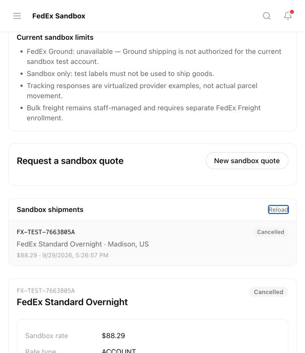

# FedEx sandbox verification — 29 September 2026

## Scope and result

EcoGlobe_Marketplace was created in the FedEx Developer Portal after explicit user approval of the license agreement and non-vendor declaration. Test credentials are stored in Azure Key Vault, never in this repository. Selected APIs: Ship, Rates and Transit Times, Basic Integrated Visibility, Pickup Request, Address Validation, Postal Code Validation, and Service Availability. US sandbox testing is enabled. Production keys and shipping are not enabled.

The admin-only `/admin/fedex-sandbox` test desk uses real FedEx sandbox responses and SQL-persisted quotes, booking state, PDF bytes, tracking scans, and cancellation state. It does not automate marketplace orders, book pickups, or charge money. Existing marketplace logistics remains staff-managed. No runtime rates or tracking events are fabricated in EcoGlobe.

## Verified locally

- OAuth, Standard Overnight account rates, shipment creation, PDF label, tracking, and cancellation returned successful FedEx responses.
- Chrome → standalone admin → backend → FedEx → isolated SQL completed quote, explicit booking, PDF download, tracking refresh, cancellation, and reload persistence.
- Browser shipment `16D63A2C-CA24-42EC-A731-53D55883AD22`: provider quote USD 88.29; tracking `794876507052`; cancelled successfully. Synthetic sender/recipient data only.
- The browser downloaded a 38,304-byte valid PDF. A browser download watcher timed out, but the downloaded file and successful proxy response independently confirmed delivery. Label is marked TEST / DO NOT SHIP.
- Anonymous API/label access returns 401; buyer access returns 403; unsupported Ground requests return 400. Replaying a confirmed booking returns the existing tracking number without creating another shipment.
- Provider boundary tests cover malformed input, parcel limits, unsupported service/country, explicit sandbox-only configuration, sanitized 4xx failures, uncertain network outcomes, and invalid PDF rejection. Full backend suite: 51 tests pass.
- SQL uppercase UUIDs initially caused a quote mismatch; corrected case-insensitive comparison and verified successful booking of the original quote.
- Atomic SQL booking claim prevents concurrent duplicate submissions. Definite rejection is `booking_failed`; uncertain provider/persistence outcomes are `booking_unknown` and cannot be automatically rebooked. An administrator must reconcile an uncertain outcome with FedEx before arranging a replacement; no automated reconciliation is implemented.
- SQL list/detail reads exclude PDF bytes; authenticated label endpoint returns private/no-store PDF.
- Reciprocal Orca review: Claude frontend, coordinating Codex backend. Claude reviewed backend; Codex reviewed frontend. Two Codex worker launches failed before execution, so coordinator implemented backend directly. Unrelated worktree edits preserved.
- Scoped React Doctor: no errors; six warnings (component complexity/size and prop-related state reset). The full-repository scan also reports pre-existing issues outside this change; not a repository-wide clean bill of health.

## Provider limits / remaining gates

- Ground rate calls returned HTTP 503; Ground shipment creation returned `GROUND.SHIPPING.NOTAUTHORIZED`. Ground is disabled in EcoGlobe's sandbox service selector.
- Tracking returns virtualized historical provider examples (2023 scans), not GPS or evidence of real parcel movement. These scans never advance commercial order/delivery state.
- Bulk freight eligibility is unconfirmed. FedEx Freight has a separate portal/account setup; its login is pending user access. A parcel account and enabled parcel APIs do not prove freight entitlement.
- Pickup, address/postal validation, and service-availability APIs are selected on the project, but their application workflows were not implemented or tested in this release.
- Production requires provider activation/certification and an explicitly approved real-shipping rollout. This sandbox desk is not a production carrier-booking release.

## Development deployment

Application commit `f7709b8` is pushed to `rthomas98/ecoglobe-mvp-backend`.

- Azure revision `ecoglobe-backend-dev--0000029` is Healthy / Provisioned, receiving 100% latest-revision traffic. Image `ecoglobe-backend:fedex-f7709b8`, digest `sha256:0cfc14179a7f9a13d381e6527527d4b649277e9e99aa4f8c80825f81e6c00a80`.
- Additive SQL migration applied successfully to the development database. Existing records were not reset.
- Backend uses `FEDEX_MODE=sandbox`; client ID, client secret, and test account are managed-identity Key Vault references.
- Admin deployment `dpl_2HifyMP1zeTZwWX6jko5bLcht5e8` READY and promoted to https://eco-globe-dev-admin.vercel.app.
- Web deployment `dpl_FosioQ36wqvUcCoWHuBajJ8oq561` READY and promoted to https://eco-globe-dev-web.vercel.app.
- Chrome on the deployed admin completed quote → booking → PDF download → tracking → cancellation → reload. Shipment `7663805A-316A-4206-BA87-966FEF293655`, USD 88.29, tracking `794876510438`, cancelled at 2026-09-29 22:28:03 UTC. Synthetic test contacts only. Downloaded PDF validated at 38,262 bytes.
- The deployed tracking panel shows the actual provider scan timestamp and clearly labels historical sandbox responses. Cancelled state survives reload.
- Live development API checks: configured list 200; anonymous 401; buyer 403; unsupported Ground 400.
- Additional local persisted checks: quote retry returns the same row; changing its package with the same key returns 409; cancellation replay returns cancelled without another provider request.
- Backend tests 51/51; backend, web, and admin builds pass. Scoped React Doctor has no errors and six warnings as described above.

Test entry: https://eco-globe-dev-admin.vercel.app/admin/fedex-sandbox (administrator login required). Use **New sandbox quote**, enter synthetic US sender/recipient and parcel details, request quote, confirm booking, download the TEST PDF, refresh tracking, and cancel. Do not attach test labels to goods.

