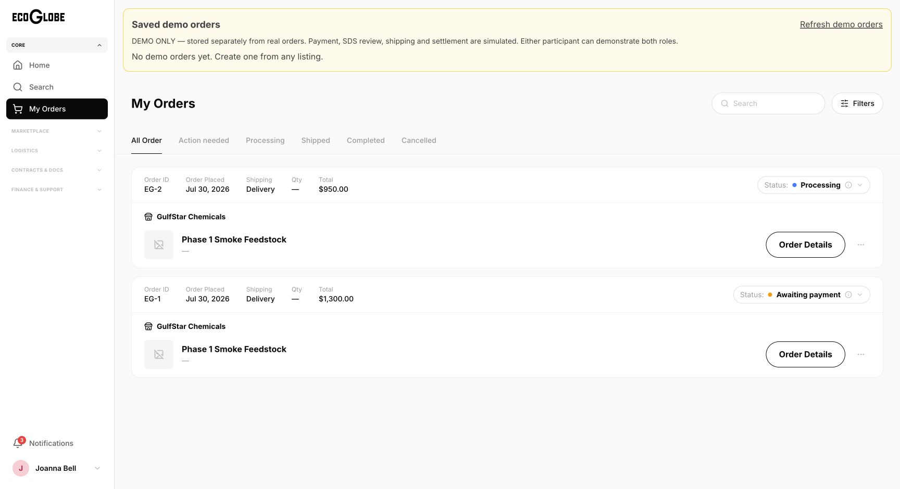
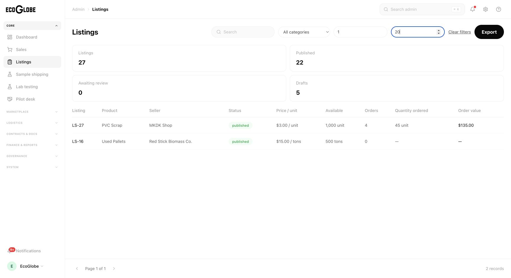
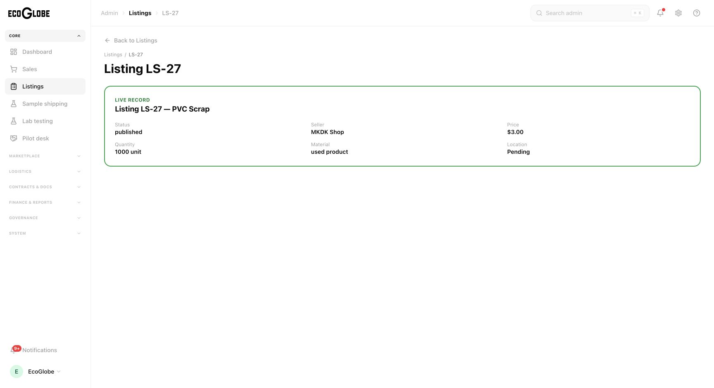

# Web MVP development release verification

Scope: responsive public, buyer, seller and admin web portals backed by persisted API records. Native mobile, advanced analytics/blockchain and FedEx onboarding are deferred by the user. Production DocuSign commercial templates/Go-Live remain deferred.

## Current evidence

- Backend runtime isolation: 22 checks passed.
- Backend unit suite: 48 tests passed.
- Backend type check passed.
- Dedicated local SQL/API smoke passed: real document bytes/download, tenant rejection, persisted KYC/contact/RFQ, rejection of fabricated payment/escrow success, session revocation, buyer quote-term protection.
- SQL checkout reservation checks passed: duplicate concurrent requests create one order, saved accepted quote price is used, changed retry payload rejected, concurrent oversell rejected.
- User-approved sandbox Accounts v2 Write saved; provider API read returned 200.
- Sandbox seller onboarding completed with Stripe test bank data; authoritative backend sync reports sellerReady=true, mode=test (account acct_1UL2jpCEJFfNI9Lk).
- Stripe-hosted sandbox card payment completed in Chrome for local order 12. Backend reconcile twice reports paid; provider-backed event replay stores one captured payment and one event. This is not proof of external webhook delivery.
- Unpaid sandbox order 9 cancellation and duplicate cancellation both pass; saved state expired.
- Fresh isolated QA database eco_migration_qa_8805a47d6445: all 23 schema/migration scripts pass, including ordered/guarded checkout recovery and lease columns.

## New recovery behavior requiring provider acceptance

Checkout uses persisted random bindings and Stripe idempotency; ambiguous provider failures retain stock until authoritative reconciliation. A bounded recurring worker recovers missing bindings and expired sessions. Provider metadata alone cannot mark an order paid; mode, amount, currency and stored session must match. A webhook arriving before the session binding asks Stripe to retry.

## Outstanding gates

- Reciprocal frontend/backend review approved. Combined backend/shared/web/admin build and web/admin lint pass (web 39 warnings, 0 errors). Final browser follow-up files pass owner types/lint; final combined rebuild and lint passed after those changes (exit 0).
- Chrome passed: buyer captured payment/receipt/order status; seller connected Stripe test account; admin saved sales; document upload/reload/exact download bytes; seller RFQ response, buyer acceptance, $46 Stripe checkout; unpaid order cancellation with stock restored.
- Remaining browser gates: broader negative-path/tenant-switch tests. A fresh Chrome tab now applies the 390px viewport correctly. Payment exceptions and admin navigation passed at measured 390x844 with no page-level horizontal overflow; broader responsive flows remain to test.
- Externally delivered webhook and failure-recovery browser acceptance remain outstanding. Seller onboarding, card checkout and duplicate reconciliation pass as recorded above.
- Payment refunds and seller settlement must not be claimed complete without implementation and provider evidence.
- Combined release committed and pushed as `1b20c40` on `rthomas98/ecoglobe-mvp-backend`; deployed to the existing development services on September 29. See release evidence below.

Implementation is in isolated Orca worktrees `ecoglobe-mvp-backend` and `ecoglobe-mvp-frontend`; primary checkout is preserved.

## Provider and browser details

- Local signed webhook HTTP checks: valid delivery 200, duplicate 200, invalid signature 400. Signing fixture is local-only; no external webhook delivery claim.
- Browser-created quote used 2 tons at $23, creating order EG-13 at $46.00 in Stripe sandbox; frontend cancellation persisted cancelled and restored 2 tons.
- Uploaded document ID 19 retained exact bytes, SHA256 e314d2ea555ba4c469285f8cd8c145ba86b37eeb97412441ca60c8af9b6d0753.
- Final frontend integration hashes: 2026-09-29-frontend-integration.json.
- React Doctor on current diff: 73/100, 18 warnings, no errors. Initial scan against origin/main included prior work and reported 8 errors outside this MVP diff; not silently attributed to this change.
- Late-payment anomalies are persisted and now visible in a read-only admin Payment exceptions inbox (web and standalone admin). Automated refunds/settlement remain unimplemented.

- Admin browser: contact inbox displays the exact synthetic message; document approval persists the review note and approved status. KYC review completed with explicit local QA authorization: empty notes rejected; request-information decision persisted; approval restored AgriCorp Solutions (company 1) to its original verified status. Browser and backend confirmed restoration. Shared development and production were not changed.

- Buyer saved-card setup completed after explicit user approval using synthetic Stripe card 4242. Stripe returned success; backend setup-status independently reports ready=true, mode=test; buyer Bank Account page shows Connected through Stripe / Test mode / Payment method verified with Stripe. No real card or funds used.

## Continued verification

- Added GET /api/admin/payment-exceptions with open/all filter and bounded results. Live local API checks: admin 200, buyer 403, anonymous 401, invalid filter 400. Checks added to SQL smoke suite.
- Reciprocal review passed. Chrome verified permission-denied handling and a persisted synthetic QA exception with order, companies, amount, reason and provider reference. The inbox cannot issue refunds or mark exceptions resolved; Stripe refunds do not automatically close local exceptions.
- Before release, development served revision `0000026`. The release below replaces it with `0000027`. `STRIPE_WEBHOOK_SECRET` remains unconfigured pending approval of destination creation.

- Integrated payment exception changes pass backend build, web/admin TypeScript and diff whitespace checks. Full combined backend/shared/web/admin builds and web/admin lint passed (exit 0, 39 web warnings, no errors).

## September 24 feedback follow-up

Source: `24 Sept New Ecoglobe Marketplace Site test.pdf` (five pages). Its meeting assignments were treated as background, not authorization for messages or account creation. No resolved markings were present.

- Browser reproduced two cart items collapsing to one checkout and traced `clearCart()` after a single-item checkout. Checkout now lists all items, explains separate per-listing payments, retains unpaid items, and scopes resumable requests to user/company.
- Chrome completed sandbox payments for local orders EG-16 (listing 6) and EG-17 (listing 5), each $25. Returning before payment preserved both items; continuing reopened EG-16 without duplication. Paying EG-16 removed only that item; EG-17 then completed, and both appeared in My Orders. Independent SQL read confirms one captured payment per order. This is sandbox provider acceptance against isolated local SQL, not deployed webhook acceptance.
- Buyer and seller notification read-all actions persisted; after reload their badges disappeared and Unread showed no notifications. Confirmed reads now broadcast to all mounted views, and identity changes clear stale notification data.
- Seller enabled samples on local QA listing 5. Buyer saw Ask EcoGlobe about a sample and saved inquiry #1 without payment/parcel creation. Unreviewed material still requires administrator classification; carrier automation remains deferred.
- Admin maximum price 20 excluded all saved $25 listings; 24–26 and the recorded material category returned matching rows.
- Pilot country API checks passed: lowercase us accepted (200), missing country yields actionable 400, CA remains domestic-only 400. Original isolated QA country restored. Listings require a LocationId foreign key, so a nonexistent location is not a valid saved record.
- Backend checkout now enforces the existing SDS requirement; real SQL smoke rejects absent SDS and passes reservation/idempotency tests with synthetic QA document bytes.
- Latest focused checks: backend 48/48, frontend helper regressions 8/8, runtime isolation 22/22, SQL runtime tooling 12/12. Initial isolation reruns were blocked by sandbox sockets and wrong shell Node; rerun with local permissions and Node 22.20.0 passed.
- React Doctor: 71/100, 22 warnings, no errors. Remaining warnings concern complexity, duplicated JSX, render-time date formatting and existing event-handler patterns; no blanket suppression applied.
- Stripe development webhook form prepared for checkout.session.completed, checkout.session.async_payment_succeeded and checkout.session.expired. Creating the destination and storing the signing secret awaits explicit browser access confirmation.

- Final combined release builds and lint passed after all September 24 feedback and admin badge/sign-out fixes: exit 0, 39 existing web lint warnings, no lint errors. Admin detail browser check opened LS-5 and matched its saved title, seller, $25 price, and 1-ton remaining quantity.

## Development release — September 29

- Application commit: `1b20c40`, pushed to `origin/rthomas98/ecoglobe-mvp-backend`. Primary and frontend worktrees preserved.
- Five additive September 29 SQL migrations applied successfully to `sqldb-ecoglobe-dev`; no reset or seed.
- Azure image `acrecoglobe7c180adf.azurecr.io/ecoglobe-backend:mvp-1b20c40`, digest `sha256:db5fd882f2167ed24c3dc13bc680ae50a1e889855f621ecd908fee545a9b0217`; revision `ecoglobe-backend-dev--0000027` Healthy/Provisioned. Public health reports database connected.
- Web deployment `dpl_8YvRqxXnH6X14mVPPzuh1CHSwazH` READY and promoted to https://eco-globe-dev-web.vercel.app.
- Admin deployment `dpl_7Zp5YUL8RS8bokx8tAwULnEdWkDQ` READY and promoted to https://eco-globe-dev-admin.vercel.app.
- Chrome deployed acceptance: demo buyer login; 22 persisted listings; saved orders with honest missing-photo placeholders and no captured console errors; admin login and 20 saved sales; live notification count 89 (rather than static 8); $1–$20 filter returns PVC $3 and pallets $15; selected LS-27 detail matches PVC/MKDK/$3/1000 units; admin sign-out returns securely to login.
- Deployed API acceptance: buyer/seller/admin login 200; payment exceptions admin 200, buyer and seller 403, anonymous 401.
- Full two-order checkout, notification read-all, sample inquiry and pilot country validation evidence above remains isolated local acceptance, not a repeated shared-development transaction. Deployed listing latency has not been quantitatively benchmarked.
- Stripe webhook form remains prepared but unsubmitted pending explicit user approval; external delivery is not verified. FedEx onboarding, production DocuSign and refund/settlement decision remain outside this release.

