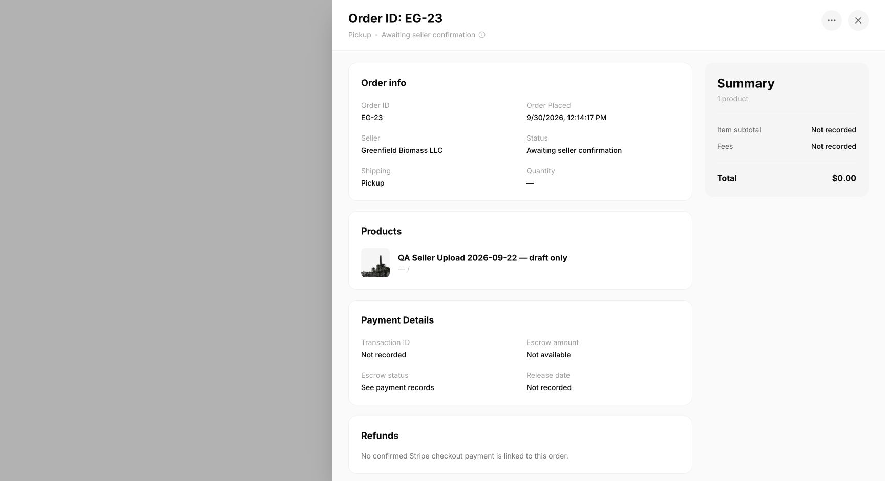
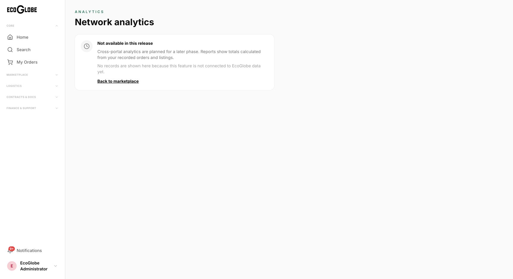
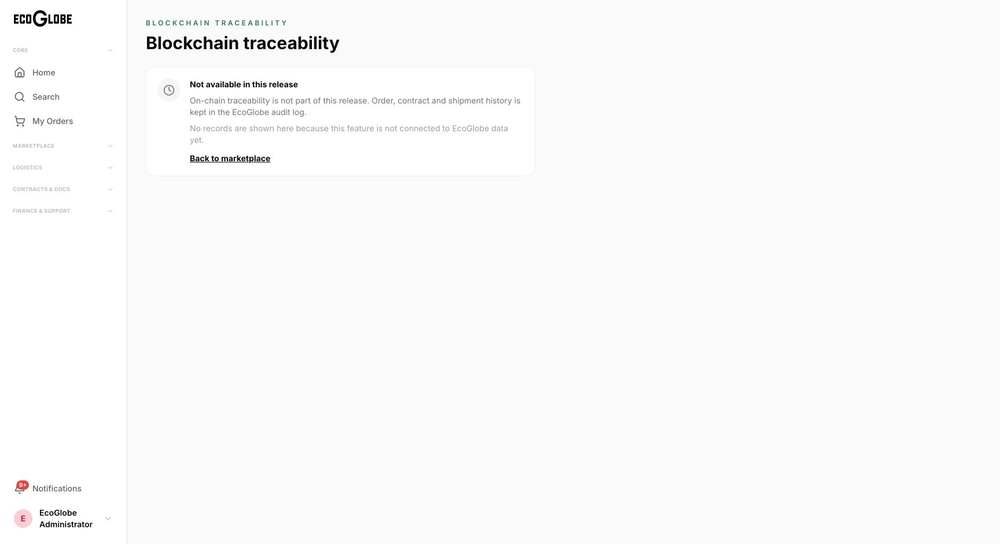

# September 30 marketplace feedback verification

Source: Ecoglobe Marketplace Site 30 sept.pdf (two pages). All four observations were reviewed; no items were marked resolved. The PDF supplies test observations, not authority to reopen previously deferred MVP scope.

## Findings

| PDF issue | Current result |
| --- | --- |
| Uploaded photo missing on buyer My Orders | Reproduced before release on QA order EG-23. Backend previously omitted the stored photo; frontend selected an illustrative image by title. Fixed to read the first saved, nondeleted photo, use the existing session proxy, and share the result between card/detail. Live Chrome retest passes for the shared order-card mapping, detail panel and direct detail URL. |
| Blockchain Attest Record does nothing | Current live route explicitly says “Not available in this release” and exposes no Attest action. Already addressed through the approved web MVP deferral; blockchain attestation is not implemented or claimed. |
| Analytics participant selection does not change | Current live route is a deferred-feature notice, with no participant table or misleading interaction. Advanced network analytics remain outside the approved web MVP. |
| New account receives static analytics totals | Current live analytics route displays no hardcoded network totals. It identifies the feature as unavailable and points to recorded-order/listing reports. No invented account metrics are presented. |

## Implementation

- Additive `listingImageUrl: string | null` on both list/detail order API responses. No schema migration or database reset.
- The selector excludes deleted documents, SDS/nonphotos and records without content/nonblank URL. Uses stable document-ID order and the existing download route for stored bytes; legacy saved HTTPS URLs remain supported.
- Buyer cards and detail use the saved photo, product-title alt text, and an accessible fallback for missing/failed images. No title/category photo substitution.
- Existing order/document access rules remain intact. A buyer cannot download a draft or private listing merely by receiving its photo path. The photo reflects current listing data, not an immutable purchase snapshot.
- Preserve all prior refund, DocuSign, FedEx, navigation and other MVP work.

## Verification

- Backend production build and 61/61 existing tests pass.
- Web type-check and production build pass.
- Changed-file ESLint: zero errors, one existing `no-img-element` warning.
- Photo URL helper tests: 4/4 pass (stored path through proxy, legacy HTTPS, no-photo handling, unsafe-source rejection).
- Exact changed SQL executed read-only against existing development orders: EG-13/14 point to JPEG document 8, QA EG-23 points to PNG document 6, EG-22 has no saved photo and returns null.
- Exact selector tested with read-only SQL row expressions: stable first photo, SDS/deleted/blank exclusion, retained legacy URL and missing-photo null all pass.
- Focused React Doctor against prechange HEAD: zero errors; one preexisting complexity warning in the order detail panel. Initial branch-vs-main scan included unrelated inherited diagnostics; it is not evidence that this patch introduced them.
- Local Docker SQL startup timed out at `docker info`; no database was reset or modified to recover it. Read-only development SQL verification and live FE/BE checks are the acceptance path for this change.

## Release and browser acceptance

Implementation commit: `ff16f834bd3d63a6998256bf2ac0520548541ca7`, pushed to `rthomas98/ecoglobe-mvp-backend`.

Azure image: `ecoglobe-backend:photos-ff16f83`, digest `sha256:641f56a3a4487194a5137e8ec014527faf69be7fbeb3e27c0bbc5909acfc2e08`. ACR run `cax` passed.

Vercel preview: `dpl_CMShvnDJ9Wk29SVwf8HWTnGCXpNa` reached Ready. Vercel promotion created `dpl_CZZZd1V7B81gXnr23RpEQc494RqM`, which reached Ready and serves [development web](https://eco-globe-dev-web.vercel.app). The preview and promoted deployments were CLI uploads of the clean implementation checkout; the deployment API did not return Git source metadata. Source identity is recorded by the clean checkout SHA and verified pushed branch.

Azure revision `ecoglobe-backend-dev--0000032` is Provisioned/Healthy with one replica and serves 100% of latest-revision traffic. `/health` returns HTTP 200 with SQL connected.

Live API checks pass for list/detail parity on EG-13, EG-14, EG-22 and EG-23. The authenticated buyer downloads the published PVC JPEG (113,726 bytes); the administrator downloads the private QA PNG (574,003 bytes). Anonymous orders return 401, cross-company order detail returns 403 and cross-company rows are excluded. The private QA photo remains 404 for anonymous and unrelated buyer access.

Chrome verification used the signed-in development staff QA session on buyer-facing pages:

- Before release, EG-23 rendered “No product photo” despite its uploaded document being downloadable.
- After release, its card, detail panel and direct `/buyer/orders/23` page all resolve `/api/backend/api/listing-documents/6/download`, with `complete=true`, `naturalWidth=1400`, `naturalHeight=673` and the listing title as alt text.
- EG-22 now has the accessible “No photo available for Guard Test Bagasse” fallback because no actual photo is saved. The old illustrative title-matched photo is no longer substituted.
- My Orders and direct order detail have no captured console errors during this verification.
- Both deferred routes were reloaded after release; neither exposes demo analytics totals, a participant table or an Attest action.

The original customer EG-13/14 photo association was verified through the live API; their account-specific buyer cards were not opened as those customers. The same live card/detail path was tested using the unpaid QA fixture. No real purchase is claimed.

## Test records and review

QA order EG-23 is a clearly labeled, unpaid $0 draft against existing QA listing 28 and its saved photo document 6. No checkout, inventory movement, shipment, commercial signing or refund email was triggered. This fixture remains available for review; no existing order was overwritten.

Orca run `run_f7d3067468b6`: Claude frontend task `task_60b95c54a1b7` completed; root accepted the exact frontend patch, and Claude accepted the backend SQL patch. The requested GPT 6.1 Sol worker was rejected by its provider as unsupported for this ChatGPT account; root completed the backend task after user-approved stop/release. The settled Claude terminal is retained as operator-owned; no managed resource awaits reclamation.

## Evidence

## Retest instructions

Open My Orders on the development web site, reload, and open a saved order whose listing has an uploaded photo (for the reported customer, EG-13/14 PVC Scrap). Confirm the photo matches the listing in the card and Order Details. A listing with no saved photo should show “No photo available.” Advanced network analytics and blockchain remain visibly deferred under the agreed MVP scope.
