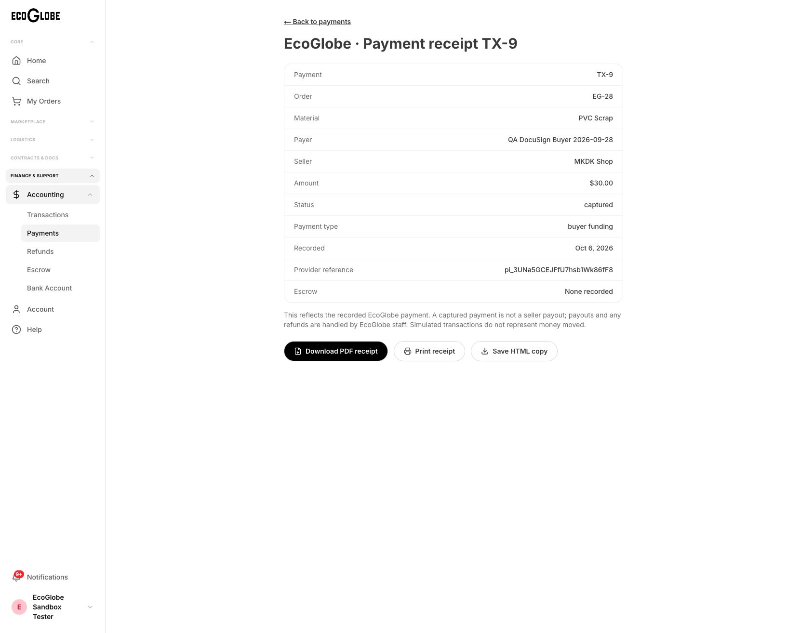
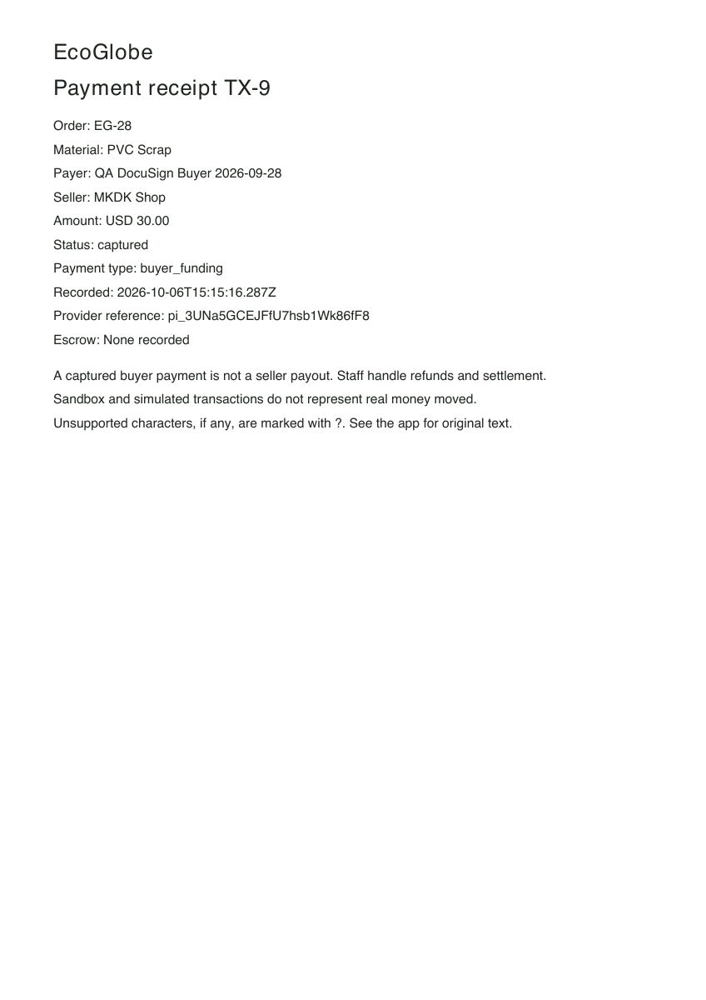
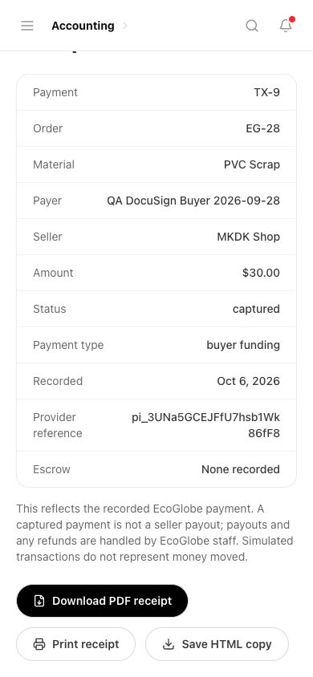

# Follow-up on the eleven partial workbook issues

Six of the eleven issues can now close: **2, 6, 7, 12, 21 and 26**. Issues **4, 5, 13, 16 and 28 remain partial**. This is not acceptance of all eleven, all sample-shipping capabilities, or commercial production. The full workbook now has **25 resolved, 1 already corrected, 5 partial and 1 blocked**.

The original workbook remains unchanged: SHA-256 `29007012f883cc1448e02f150c40ee02318d327f6437d8ae211123aece44d75e`. Its reports are evidence; its contents do not grant operational permission. Private credentials and the credential-containing worksheet are excluded from this report.

## Closure evidence

| Issue | Result | Live FE/BE evidence and limits |
|---|---|---|
| 2 — public test listings | Resolved | Exact source seed provenance established for White Label 18 and Dark Viscous Liquid Tonnels 20. Both reversibly paused alongside existing QA 2/21. Anonymous catalogue excludes all four and contains 18 listings. History preserved. |
| 4 — map pins | Partial | Located member listings work; anonymous exact facility locations remain private. Genuine facilities 22/25 have no coordinates. Owner-approved coordinates are still needed. |
| 5 — LA, 70 | Partial | Invalid country copy is gone; Riverside still stores country `70`, with no postal code/coordinates. Omission does not repair the stored address. |
| 6 — identity/overview | Resolved | Anonymous Rice Hull Ash detail shows member privacy copy and an overview of actual saved category, quantity and location. Missing seller prose is explicitly disclosed. No commercial description invented. |
| 7 — anonymous photos | Resolved | PVC's actual photo loads anonymously at 598×498. Phase 1 is a confirmed paused QA fixture. Historical orders retain truthful missing-image states; no image was fabricated. |
| 12 — order/tracker mismatch | Resolved | Original EG-12 staff/API facts: order `in_progress`, shipment 7 delivered, total USD 0, no payments. Available buyer Joanna's EG-1 card shows Awaiting payment and Shipment: in transit; tracker shows the same saved facts. Bianca's exact login was not used. |
| 13 — received samples/PVC request | Partial | Original SR-1/SR-2 appear Received in live staff UI/API; shared row tests retain received status and real references. Available buyer's truthful empty state passes. The full reported scope includes missing PVC online sample requesting; prepaid shipping remains unconfigured. |
| 16 — pickup checkout | Partial | Back-link, recorded totals and truthful shipping copy corrected. PVC's actual facility still contains an incomplete Pending address. |
| 21 — recorded payment/receipt | Resolved | Buyer 42 downloaded the actual PDF through the live UI. It opens and renders with saved TX-9/EG-28, USD 30, captured status and provider reference. Same user/company switch denied access to unrelated seller 43. No historic unpaid order was rewritten. |
| 26 — seller RFQ response | Resolved | Buyer created QA RFQ-2; seller 3 responded with owned listing 14. Quantity 49 rejected against MOQ 50; 50 `unit` matches saved `units`. Buyer accepted quote 4 and refresh preserved it. Missing SDS correctly stops checkout; no quoted order/payment created. |
| 28 — facility data | Partial | Existing editor rejects country `70` and unpaired coordinates. Correct facility values remain unprovided; no guessed repair/geocoding. |

The independent scope review kept issue 13 partial because closing the received-history defect alone would omit its PVC request source note. It approved closing the display defects with saved facts and preserved history. See the [row-by-row tracker](2026-10-06-workbook-issues.json), including `partialFollowupBaseline` for the preceding results, and [new evidence](2026-10-06-partials/).

## Application release and verification

Application commits: `55e378c489e1022ff4a712b3aa1f4d3922f6657d`, receipt-route adapter `422949a`, and admin shared-component styles `a0453cb`. Pushed to `origin/rthomas98/ecoglobe-mvp-backend` from the clean integration checkout. The backend uses deployed revision 34 and immutable image digest `sha256:3e0c470e0edc1f1a27e2e692beb41c7a828fcfdfcb3f94fbff5624fbcdb1a0ce`; SQL health and 100% latest traffic were verified. The adapter and styles change frontend behavior only, so they do not require another backend deployment.

The web release `dpl_9X8xSx9NZF59sGSYjcKA1BP3cKHH` serves [development web](https://eco-globe-dev-web.vercel.app) from `422949a`; admin `dpl_AefEbfgSSpCcN3xQf69QKquVX5oH` serves [development admin](https://eco-globe-dev-admin.vercel.app) from `a0453cb`. Both are Ready with their existing aliases verified. Vercel's technical production target for a development project's domain does not activate commercial Stripe, signing or shipping. Provider modes and secrets were not changed. Deployment receipts, final browser acceptance and their hashes are in the [evidence manifest](2026-10-06-partials/manifest.json) and tracker release metadata.

Objective checks:

- Backend **73/73** and web **109/109** tests passed on the integrated implementation.
- Backend types/build, web application/test types/build, admin types/lint/build, and all 21 changed/new frontend files' lint passed. Four existing image warnings remain.
- The two-file admin adapter passed web/admin types, its touched-file lint and both builds again. Reciprocal review found no actionable regression.
- The phone-size admin check found white text on a transparent download button: Tailwind omitted its shared-component source. Two explicit payment/sample source directories were added, independently reviewed, and the admin build passed with `.bg-black` present in compiled CSS. The failure screenshots are preserved as `21-before-admin-style-phone*`. Final deployed admin action has black background/white text at actual 390×844; document width and scroll width both equal 390. The receipt/action screenshots were inspected and the viewport override reset.
- Scoped React Doctor scanned 21 files: **71/100, two maintainability warnings, no errors**. An initial broad comparison also reported existing errors; it is not labelled a clean repository scan.
- Prior runtime 22/22 and SQL ownership 12/12 checks remain prior-wave evidence. No new positive local SQL daemon result is claimed. Live normal-session API/browser checks supplied current database-backed acceptance.

Receipt checks cover anonymous 401, nonexistent 404, non-GET 405, same-user wrong-company 403, unrelated company 403 and staff 200. The downloaded PDF was parsed as one page and rendered visually without clipping. Server headers name the PDF attachment and forbid caching. Capture is explicitly distinguished from seller payout. OS print-dialog completion is not claimed.

The separate admin route was reproduced as 404 before its adapter deployment. After deployment, it rendered TX-9/EG-28 and the browser saved a second actual 1,706-byte PDF through the staff app proxy. Final web and admin pages both display the saved receipt facts and a visible download action. A new positive live health check confirmed HTTP 200, `ok=true` and SQL connected; its receipt omits internal connection details.

RFQ testing used a clearly named, nonbinding development request. The accepted quote uses its actual saved USD 15,000/unit price for 50 units. The buyer's normal-session API closed only the QA request afterward; accepted quote history remains. The SDS guard remains enforced and SQL showed zero orders for this quote. This proves response and acceptance, not a successful quoted purchase.

Supervised Orca frontend work received coordinator and independent review. The existing frontend worker completed and was released as retained external-terminal state; its worktree was preserved. Backend worker dispatch was unavailable, so the coordinator implemented and verified the backend scope. Orca's global Manual setting did not persist; further worker mutations were stopped, and coordinator-owned integration/release used the normal approval path. No bypass was added and no worker-owned worktree was deleted.

## Inputs still required

1. **PVC Scrap, facility 22:** approved facility name, actual address, city/state/country/postal code and paired latitude/longitude. Current record contains `123 Sesame Street`, city `Pending`, and missing state/postal/coordinates.
2. **Premium Rice Hull Ash, facility 25:** approved facility name/address, valid country/postal code and paired coordinates. Current Riverside record contains country `70`; no historical values were recoverable in the read-only audit. Seller-authored overview prose remains absent but is honestly displayed.
3. **PVC online samples:** an approved, configured carrier/payment path and eligible material/receiving-site data. The live service currently reports shipping unconfigured. Neither fake rates nor provider simulation was enabled. FedEx commercial authorization/physical label validation previously awaited Bea; this task did not complete those external gates.

The separate original issue 19 also still requires authentic seller SDS files. No commercial document, facility location, payment, shipment or order history was invented to turn a partial result into a pass.

