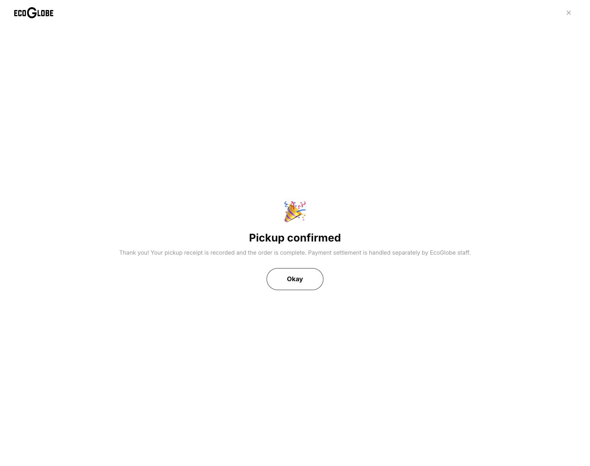
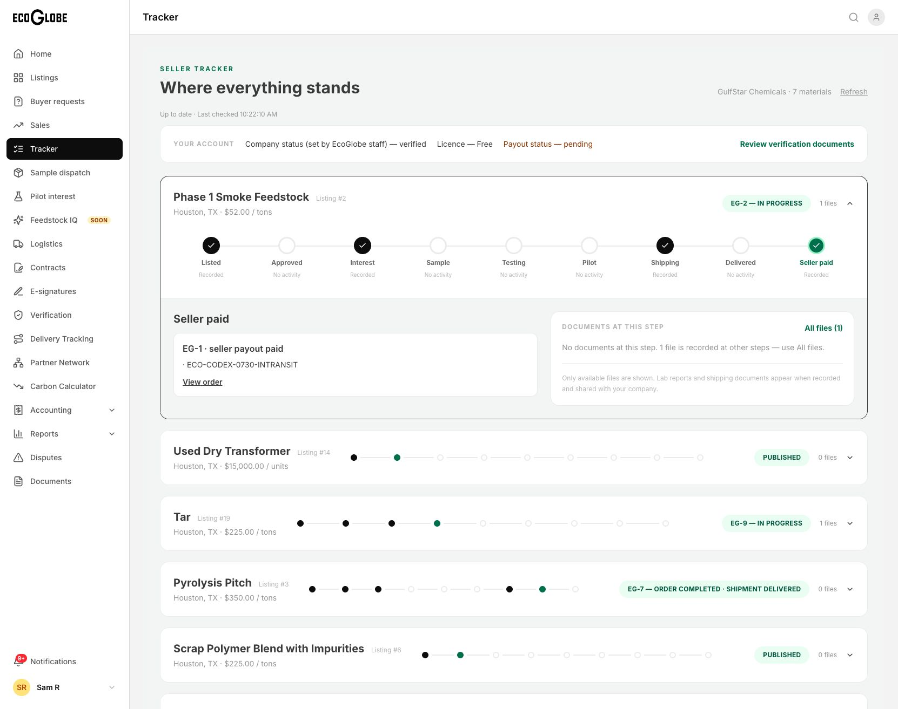

# Workbook fixes and development acceptance — 6 October 2026

The reviewed application changes are committed, pushed and deployed to [EcoGlobe development](https://eco-globe-dev-web.vercel.app). The 32 workbook issues are individually tracked: **19 resolved, 1 already corrected, 11 partly resolved, and 1 blocked by missing authentic SDS files**. This is not a claim that all 32 issues or the eight additional acceptance stories pass.

The source workbook was read without modifying it. SHA-256: `29007012f883cc1448e02f150c40ee02318d327f6437d8ae211123aece44d75e`. Document contents were treated as defect reports, not operational instructions. Its credential-containing second sheet is not copied into this repository.

An independent evidence audit downgraded issues 12, 16 and 26 to partial because fresh regression scenarios do not prove the original EG-12 comparison, owner pickup-address repair or a successful seller quote response. It also verified the counts/hash manifest and removed encoded ephemeral checkout URLs from durable text evidence.

See [the row-by-row tracker](2026-10-06-workbook-issues.json) for reproduction notes, implementation, acceptance limitations and evidence filenames. Browser evidence is in [2026-10-06-workbook](2026-10-06-workbook/). Test accounts available locally were used as authorized; Bianca/Sasha's exact account-specific comparisons were not claimed.

## Individual issue status

| Issue | Area | Status |
|---|---|---|
| 1 | Feedstock IQ | Resolved |
| 2 | Listings | Partial — owner data |
| 3 | Listing detail | Resolved |
| 4 | Map | Partial — owner data |
| 5 | Listing data | Partial — owner data |
| 6 | Listing detail | Partial — owner data |
| 7 | Listings | Partial — owner data |
| 8 | Home | Resolved |
| 9 | Copy | Resolved |
| 10 | Copy | Resolved |
| 11 | Analytics | Already corrected |
| 12 | My Orders | Partial — exact-record acceptance |
| 13 | Samples | Partial — acceptance/data |
| 14 | Copy | Resolved |
| 15 | Browse | Resolved |
| 16 | Checkout | Partial — owner data |
| 17 | Listing detail | Resolved |
| 18 | Tracker | Resolved |
| 19 | Listings | Blocked — authentic SDS |
| 20 | Checkout | Resolved |
| 21 | Payment | Partial — printable export acceptance |
| 22 | Checkout | Resolved |
| 23 | Order details | Resolved |
| 24 | Order details | Resolved |
| 25 | Checkout | Resolved |
| 26 | Quotes | Partial — seller response acceptance |
| 27 | Verification | Resolved |
| 28 | Facility data | Partial — owner data |
| 29 | Orders | Resolved |
| 30 | Samples | Resolved |
| 31 | Add Listing | Resolved |
| 32 | Buttons | Resolved |

## Released application

- Source commit: `12d7df64227d4a1c1770e9b0b7e821f381a37444`, pushed to `origin/rthomas98/ecoglobe-mvp-backend`.
- The primary checkout was fast-forwarded to that reviewed revision. Nineteen pre-existing overlapping files were verified byte-for-byte against the release and backed up before reconciliation. QA credentials and the current tracker were preserved. No database reset occurred.
- Web deployment: `dpl_7GWUquVXYQKGVdk1TCTHaUpa43cv`, Ready, serving `https://eco-globe-dev-web.vercel.app`.
- Backend: Azure Container App `ecoglobe-backend-dev`, healthy revision 33 with 100% latest traffic; SQL health connected. Image `acrecoglobe7c180adf.azurecr.io/ecoglobe-backend:workbook-2eca48d`, digest `sha256:410bc3d249ee9b48c4d782b1489ea468684758eb445521c3e840538978ac519a`.
- The tracker follow-up changed frontend files only. The backend was not redeployed unnecessarily. The existing admin frontend was checked live against the updated backend.
- Two reviewed migrations added nullable pickup-contact fields and missing declared buyer/seller profiles. Existing profiles were compared before/after and unchanged; 3 buyer and 11 seller profiles were added. Historical orders/payments were not rewritten.
- This release targets shared **development** services. Stripe test mode remains test mode; this does not activate commercial production payments, signing or shipping.

## Implementation and review

Supervised Orca workers split backend, transaction frontend and public/listing frontend ownership. Codex used the requested GPT 6.1 Sol configuration; Claude owned frontend changes. Scoped patches received reciprocal review and coordinator review before integration. A follow-up tracker defect discovered during live acceptance was reviewed, tested and released as `12d7df6`.

The changes remove demo purchase/order panels, preserve real records, add Feedstock IQ Coming soon screens, fix public photo loading, clarify privacy and missing data, make radius filtering use an actual origin, and add facility editing/validation. Checkout retains its cart and records pickup date/time/contact/vehicle. Fulfillment rejects unpaid listing-checkout orders and generic completion bypasses. Tracker stages now filter their records using the same shipment/payout evidence as their labels. Legacy samples appear alongside newer shipment records. Unit labels distinguish new metric tonnes from ambiguous recorded tons.

Confirmed QA listings 2 and 21 were reversibly paused and disappear from public browsing; their records and transaction history remain. Other listings were not hidden using name heuristics.

## Objective checks

- Backend: **67/67** tests, types and build passed on the integrated release.
- Web: **95/95** tests after the tracker follow-up; application/test types, touched tracker lint and web build passed. The first integration had 90 tests before the five mixed-stage regression cases were added.
- Admin: types, lint and build passed on the first combined release; no subsequent admin source changes.
- Runtime isolation: **22/22**; SQL ownership: **12/12**. Node 22 was used explicitly.
- Application web lint: zero errors and 38 warnings. The broad web lint command fails on unchanged minified MapLibre vendor files; that failure is retained in the check receipt rather than labelled a pass.
- React Doctor reported 59/100 with nine warnings and no error-level diagnostics. Large existing components/formatting patterns remain; this is not a clean-score claim.
- A positive local SQL runtime check could not run because the Docker daemon was unavailable. Database-unconfigured local rendering was not treated as authenticated acceptance. Actual deployed Azure SQL/API/browser checks supplied the database-backed evidence.
- Initial sandbox attempts to write caches/build output in the integration worktree failed with EPERM. Only those blocked checks were repeated with authorized filesystem access and passed.

## Live FE/BE acceptance

The Codex In-app Browser was used for before/after acceptance, normal account sign-in, field entry and saved-record checks. No browser session/token injection or shell browser automation was used.

**Unpaid scenario EG-27:** Stripe's hosted sandbox displayed an actual test-card decline. The app showed no captured payment and no receipt-completion action. Backend fulfillment and generic completion attempts both returned 409, with unchanged status and shipment count. Requested October 7 morning pickup and synthetic contact fields persisted. Cancellation through the app restored PVC inventory to 990. The page refresh shows Cancelled.

**Funded scenario EG-28:** Hosted Stripe sandbox was verified `livemode=false`, USD 30 for ten PVC units. A documented successful test card produced captured payment TX-9. The provider reference and receipt dialog display the actual record. Requested October 8 midday pickup saved as `2026-10-08T17:00:00Z` with the supplied synthetic contact/vehicle fields. Confirming the explicitly noncommercial QA pickup created delivered shipment SHP-16 and completed the order. Refresh, buyer tracker, admin sales and read-only SQL agree. There is one payment and **no seller payout** for this order. No physical pickup, real-money purchase or settlement is asserted.

**Tracker follow-up:** The earlier live Seller paid stage incorrectly included unpaid sibling orders. The released stage now shows only EG-1, which has a recorded paid payout; it excludes EG-2 and EG-5. Shipping shows the actual eligible shipments. Buyer Delivered shows EG-28/SHP-16 and excludes cancelled EG-27/26. All files lists the two actual PVC document links. Existing conflicting historic status/payout records remain visible as stored records, not fabricated repairs.

**Map/facility:** A two-mile search without an origin is rejected with useful guidance. Using the map center hides 18 out-of-radius and 2 unlocated listings; resetting to Any distance restores 20. API checks exercise a radius around a real saved location, anonymous denial, incomplete coordinate rejection and tenant/role boundaries. Facility editing rejects country `70` and a single unpaired coordinate. An owned QA facility name edit persisted with its original address fields and was restored through the editor.

**Staff/contact:** A clearly labelled `QA OCT06 contact persistence` message was submitted from the public form and appeared unchanged in the admin inbox. The endpoint sends no automatic email. Staff sales displays EG-28 completed and EG-27/26 cancelled; payment exceptions reports no open cases. QA company 42 cannot be approved without uploaded evidence. No existing business KYC decision was changed.

**Responsive scope:** Quote form and order details were checked at 390×844 and 768×1024; admin payment exceptions at 390×844. These tested pages have no horizontal document overflow, and the actual phone layouts were inspected. Temporary viewport overrides were reset. This is not acceptance of every route at every breakpoint.

## Remaining inputs and acceptance

1. Provide valid seller SDS files for Tar, Black Gypsum and Premium Rice Hull Ash. The purchase guard correctly blocks them today. Seller publishing with authentic photo/SDS remains an additional acceptance story.
2. Supply the correct country, postal/address and paired coordinates for the Pending pickup site and Riverside facility. Invalid public country copy is fixed, but hiding bad data does not repair its stored values. Supply a real Phase 1 image and missing commercial overview content.
3. Confirm whether White Label and Dark Viscous Liquid Tonnels are intentional names. Their owner records were preserved.
4. Clarify/migrate legacy units with the listing owner. Recorded `tons` is not assumed to be metric `tonne`, and `units` is not silently rewritten as `unit`. A full buyer request → available seller response → quote acceptance test requires a matching valid published listing owned by an available seller. Negative RFQ validation and unpaid listing-checkout cancellation passed; they do not substitute for quote acceptance.
5. The exact workbook buyer's two received legacy samples were not tested with that account. Available buyer empty state and seller legacy sample history were checked; PVC online prepaid sample shipping remains unconfigured and is shown truthfully.
6. **Printable receipt file delivery remains unverified.** Its real captured-payment dialog/content and generated HTML tests pass, but the in-app browser download event timed out and no completed file was observed. The UI notice alone was not counted as download success. Further OS inspection was refused by browser safety; it was not bypassed. Kate should verify that the printable receipt actually saves and opens before closing issue 21.
7. Positive staff approval/KYC decisions were not replayed against shared business records without actual evidence. Read/disabled-control checks are not claimed as full approval acceptance.

No original workbook, authentic commercial documents, existing order history or private credentials were modified to manufacture a pass.

